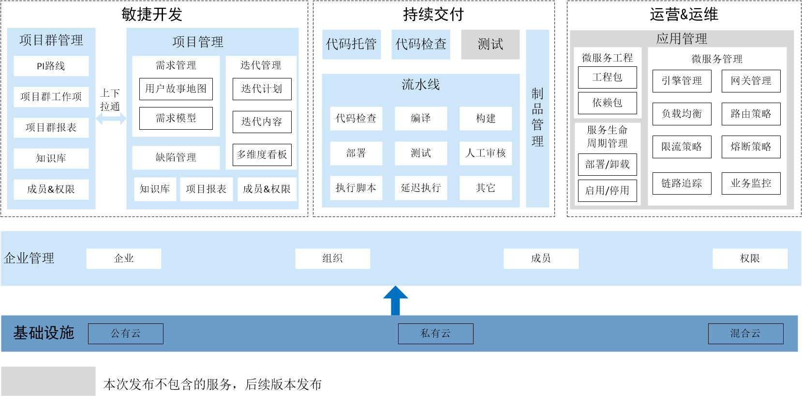

# 产品描述

Cloud Native是一款一站式DevOps平台，实现文化、流程、工具的协同改进和提升，降低应用软件高频发布带来的风险，提升软件产品质量。

DevOps改变了研发、运维的生产方式，打破组织壁垒，实现研发与运维的跨域协同，市场运营、产品经理和工程师可以共享同一个工作台，提升交付效率，真正贯通Development和Operations。

### 功能架构
Cloud Native的功能架构如下图所示。       
           
> [!NOTE]
> 本版本不包括测试和应用管理服务。测试和应用管理服务后续发布。

### 技术架构
Cloud Native采用云原生技术架构。云原生技术架构充分继承了云的设计思想，基于云计算的基础技术（如资源隔离、分布式、高可用），最大程度发挥了云的优势，帮助企业构建弹性可靠、松耦合、易管理可观测的应用系统，提升交付效率，降低运维复杂度。

云原生技术架构具有如下能力优势：
* **秒级/毫秒级弹性响应能力**       
  相对于虚拟机的分钟级弹性响应，以容器技术为基础的云原生技术架构可实现秒级甚至毫秒级的弹性响应。
* **服务自治故障自愈能力**         
  云原生技术栈具有高度自动化的分发调度调机制，可实现应用故障的自动摘除与重构，具有极强的自愈能力及随意处置性。
  
* **大规模可复制能力**        
  可实现跨区域、跨平台甚至跨服务商的规模化复制部署能力。

* **资源利用能力**     
  云原生的异构资源标准化，容器技术有效解决了异构环境的部署一致性问题，促进了资源的标准化，为服务化、自动化。容器技术的进程级资源切分粒度，降低系统的资源开销。云原生能加速数字基础设施升级，降低用户数字化技术的使用门槛，从而提高资源的复合利用率。

* **云效能释放能力**       
  云原生采用标准的技术栈、标准的服务架构、标准的API接口、标准的容器化打包方式、微服务技术，提升交付能力，实现应用的可移植性。

### 融合的理念
* **敏捷**      
    Cloud Native融合敏捷中应用最广泛的Scrum框架，通过用户故事地图和需求模型规划和分解需求，生成产品待办列表。通过迭代冲刺，规划迭代计划和迭代开发内容，跟踪迭代开发进展。通过知识库管理过程中的所有过程和知识产物。
    
* **SAFe**       
    Cloud Native通过项目群管理版本火车的愿景、路线图、团队、CoP等，通过项目管理每个PI的具体研发过程，并提供项目群层级和项目层级的两层度量，从而实现SAFe规模化敏捷。

* **DevOps**      
    Cloud Native秉承DevOps的流动、反馈和持续学习与实验的三原则，通过用户故事地图、多维度迭代看板、流水线等实践，实现过程可视化、自动化、可度量，实现产品增量快速、高质量、持续地流向客户。
    
* **持续交付**       
  Cloud Native提供可视化、可定制的自动交付流水线，将代码检查、编译构建、测试、部署等多种类型的任务纳入流水线，实现任务的自动化执行。并充分利用云上资源的弹性能力，大大缩短流水线的执行时间，实现云端可持续交付。
    
