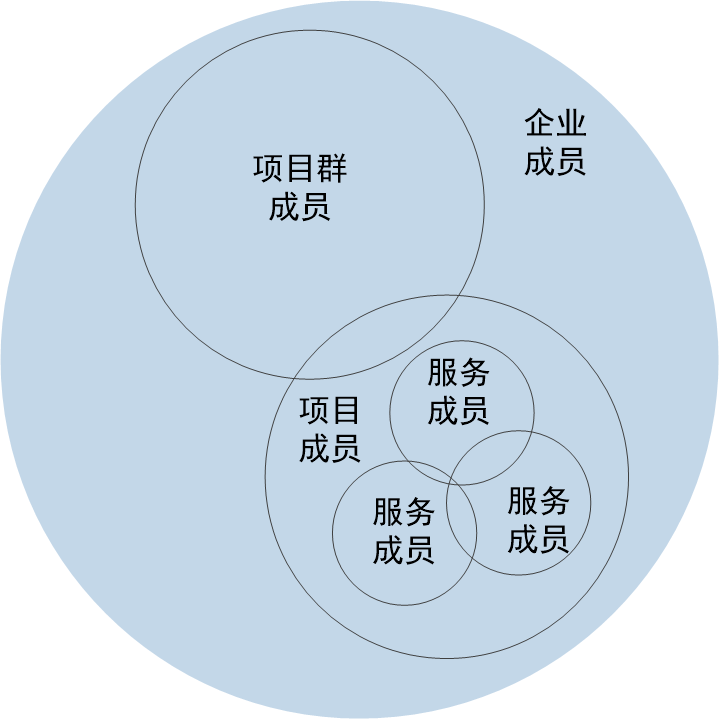

# 权限管理

在企业中，每个成员的角色在不同场景下有所不同：
* 在企业中，您可能是一个部门的管理者，也可能是一个部门的员工。
* 在一个项目中，您可能是项目经理，也可能是一名开发者。

系统采用分权分域的方式，对用户进行多个维度的权限管理：
* 企业级权限                 
    通过企业级角色赋予，具有企业用户、企业信息、企业组织架构、项目的相应权限。详细请参见[企业级权限](4.4-manage-rights-roles.md)。

* 项目群级权限                
    通过项目群级角色赋予，具有项目群各个功能的相应权限。                       
    项目群的角色可自定义。除“项目群负责人”外，项目群角色的权限可自定义。 详细请参见[项目群级权限](5.3-project-cluster-members-right.md)。
    
* 项目级权限                              
    通过项目级角色赋予，具有项目内各功能的相应权限。                        
    项目的角色可自定义。除“项目负责人”外，项目角色的权限可自定义。详细请参见[项目级权限](6.3-manage-member-role-rights-in-project.md)。

* 服务级权限                                
    某些服务（例如，代码库、流水线）有单独的权限控制，用于控制成员对于该服务的操作权限。详细请参见各服务的成员和权限管理。

各级权限之间的关系示意如下图所示。               

用户加入角色后，自动继承该角色的权限。例如，如果一个用户需要同时具备企业、项目群、项目、服务的操作权限，应执行如下操作：
1. 在企业管理中创建用户，加入企业级角色，赋予企业级权限。
2. 在项目群管理中，将企业成员添加到项目群中，并加入具有对应权限的项目群角色中。
3. 在项目管理中，将企业成员添加到项目中，并加入具有对应权限的项目角色中。
4. 在对应的服务（例如，代码库）中，将项目成员加入到服务中。如果有角色， 则将成员加入到具有对应权限的角色中。

