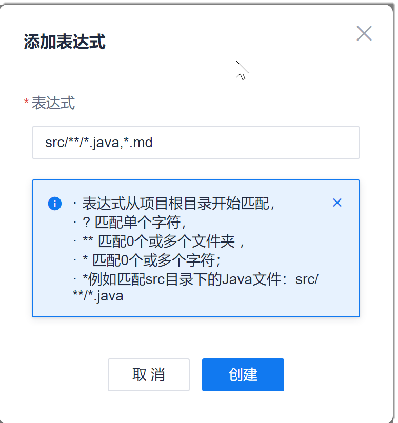

# 设置忽略文件

设置忽略文件即设置当前代码检查任务不检查的文件。当设置为文件夹时，表示不检查该文件夹下面的所有文件。

### 前提条件
* 已使用具有项目“代码检查 > 任务基本信息设置”权限的账号登录系统。
* 已创建代码检查任务。

### 背景信息            
系统采用表达式的方式设置忽略文件，表达式从代码库根目录开始匹配。表达规则如下：
* **：匹配0个、1个或多个文件夹
* ?：匹配单个字符
* *：匹配0个、1个或多个字符

例如：表达式设置为：src/**/*.java，表示不检查以下文件：src目录下的所有“.java”文件，包含直接目录下的“.java”文件和所有子目录下的“.java”文件。       
如果在一个表达式中，需要忽略多类文件，文件间使用半角逗号“，”分隔。

### 操作步骤
1. 在代码检查任务列表中，单击任务名称，进入任务详情界面。
2. 单击“忽略目录设置”页签。            
     显示以设置的忽略文件列表。               
         
     
3. 在界面右上方，单击“新建”。 
4. 在“新建”对话框中，按照表达规则，设置表达式，单击“创建”。               
      返回忽略文件列表界面，显示创建成功的忽略文件。                   
      

