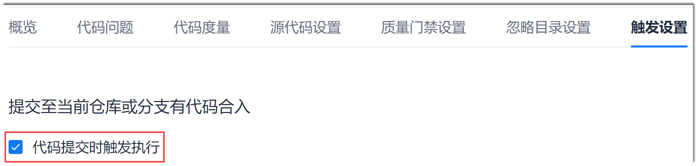

# 设置提交代码触发代码检查

您可以设置在代码提交至代码库时，自动触发代码检查任务，便于提交代码时自动执行全量扫描任务，及时发现并修复代码问题。

### 前提条件
* 已使用具有项目“代码检查 > 任务基本信息设置”权限的账号登录系统。

### 背景信息        
设置提交代码触发代码检查后，当代码源（代码库对应的分支或标签）中有代码提交时，系统将自动执行代码检查任务。

### 操作步骤
1. 在代码检查任务列表中，单击任务名称，进入任务详情界面。
2. 单击“触发设置”页签。          
3. 根据实际情况，勾选“代码提交时触发执行”。         
             

系统自动保存设置。