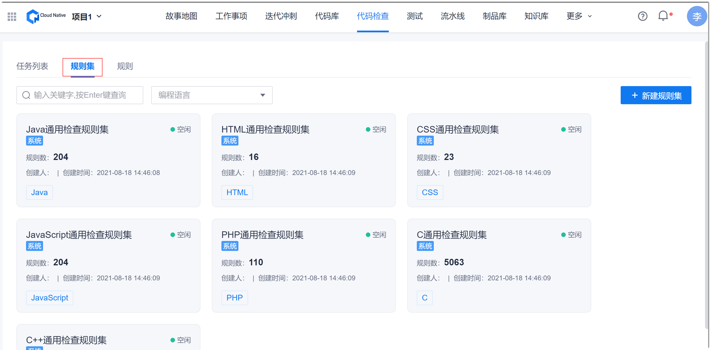
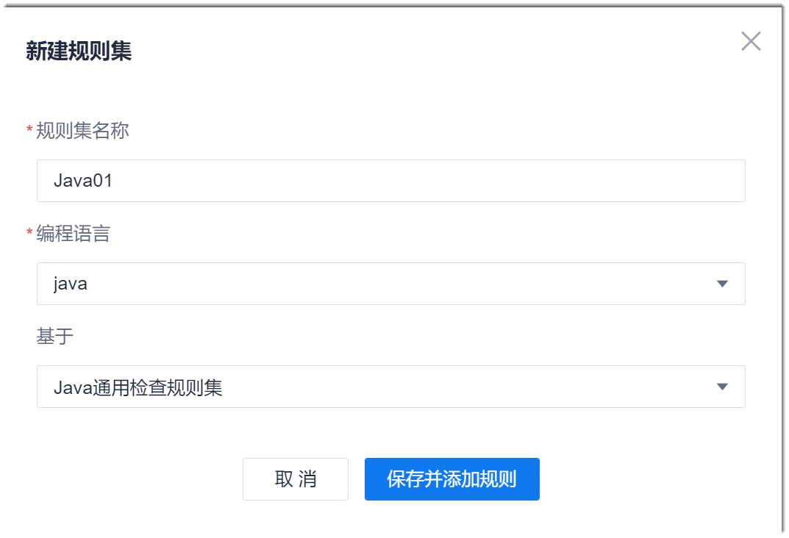
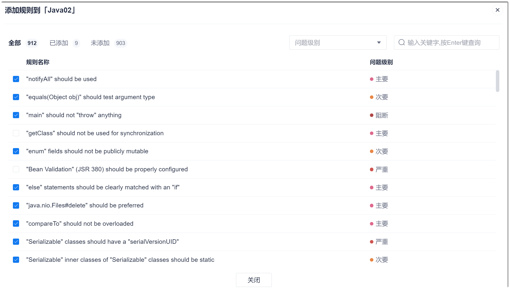
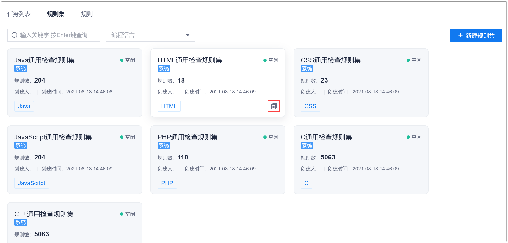
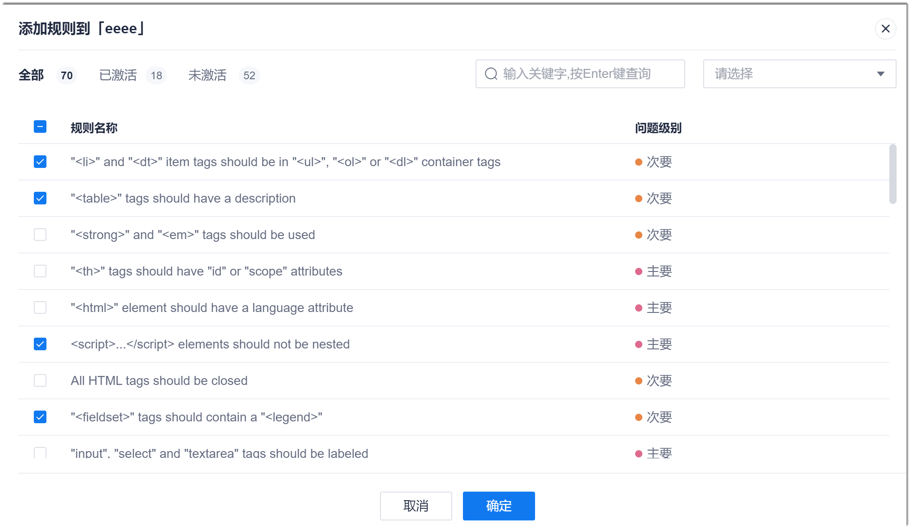

# 创建规则集

### 前提条件
* 已使用具有项目“代码检查 > 新建规则集”权限的账号登录系统。

### 新建规则集        
新建规则集可设置规则集的编码语言、基础规则集和包含的规则。      
1. 在项目顶部菜单栏中，单击“代码检查”。         
  界面默认显示代码检查任务列表页签。     
2. 在界面左上方，单击“规则集”页签。       
  界面显示规则集列表。           
          
3. 单击右上角的“新建规则集”。
4. 在“新建规则集”对话框中，填写参数，单击“保存并添加规则”。           
  其中，“基础信息”中的“基于”，表示基于已有的哪个规则集创建。选择“基于”后，“批量添加规则”步骤中会默认勾选“基于”规则集中的规则，提升规则选择效率。        
            
5. 在添加规则界面中，选中需要检查的规则，单击“关闭”。       
            

### 复制规则集       
复制规则集可在原规则集的基础上设置包含的规则。编码语言和基础规则集继承原规则集，不可设置。       
1. 在项目顶部菜单栏中，单击“代码检查”。         
  界面默认显示代码检查任务列表页签。     
2. 在界面左上方，单击“规则集”页签。       
  界面显示规则集列表。           
          
3. 鼠标移动到规则集卡片上，单击卡片右下角的。         
        
4. 在“复制规则集”对话框中，输入规则集名称，单击“保存并添加规则”。
5. 在添加规则对话框中，勾选需要的规则，单击“确定”。       
  其中，规则列表上方的“已激活”表示已选择的规则数量（继承原规则集的规则），“未激活”表示未选择的规则数量。           
     

