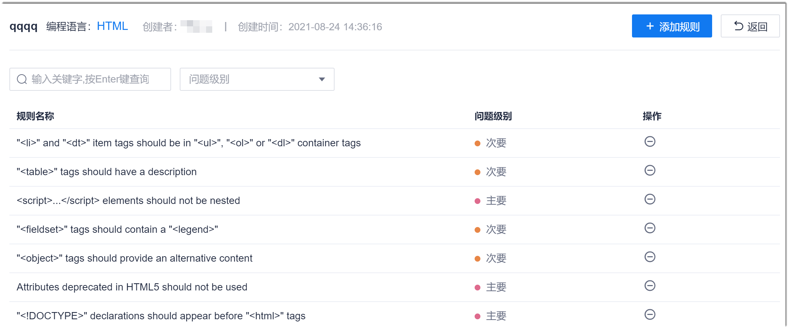
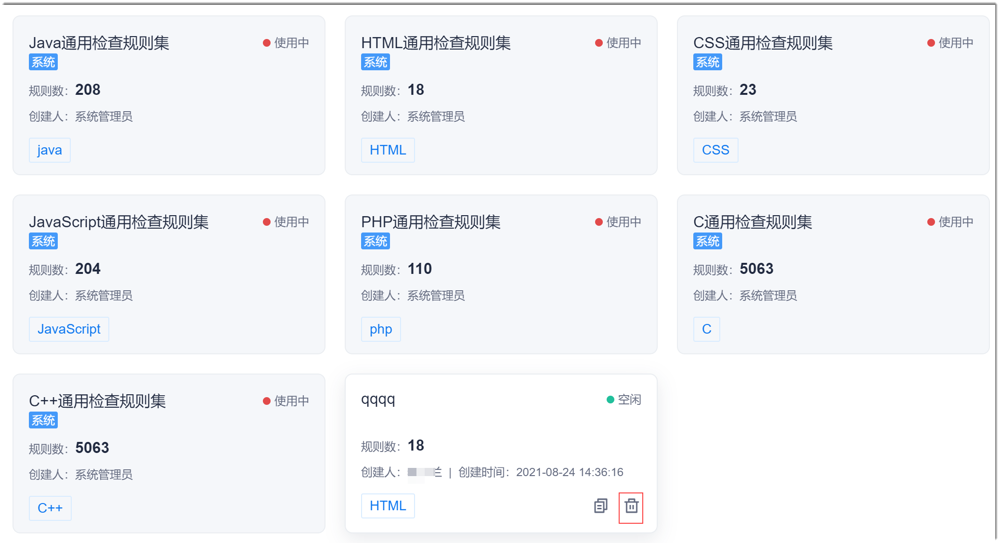

# 修改/删除规则集

规则集创建完成后，您也可以修改规则集中的规则，或者删除规则集。

### 前提条件
* 已使用具有项目“代码检查 > 编辑规则集/删除规则集”权限的账号登录系统。

### 背景信息
系统预置的规则集不能被修改和删除。

### 修改规则集
1. 在规则集列表中，单击规则集卡片，进入规则集编辑界面。       
  显示规则集中已添加的规则。           
          
2. 根据实际情况添加或删除规则：             
  * **添加规则**：单击右上角的“添加规则”，然后在“批量添加规则”界面中，勾选需要添加的规则。      
  * **移除规则**：在规则集的规则列表中，单击规则后面的。                    
  系统即时保存对规则的操作。

### 删除规则集
1. 在规则集列表中，鼠标移动到规则集卡片上，单击卡片右下角的。          
          
2. 在弹出的确认对话框中，单击“确定”。

