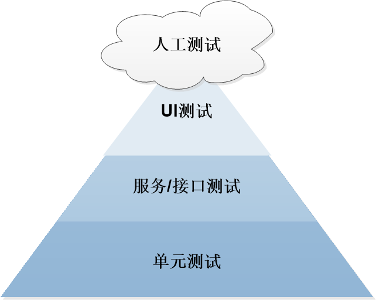
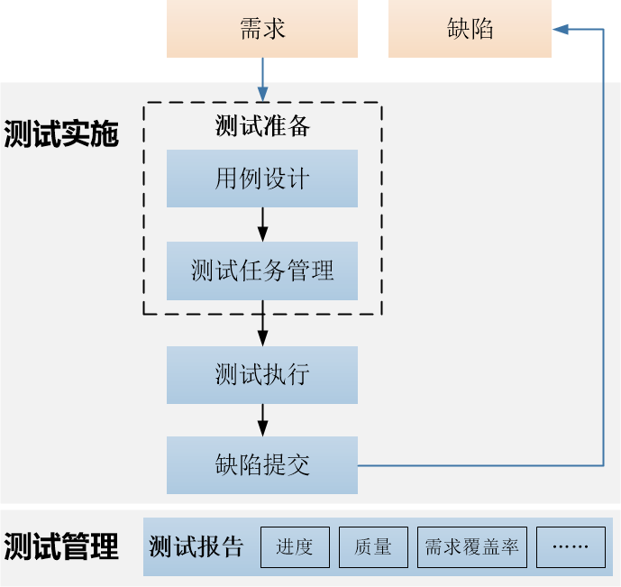

# 测试管理概述

系统的测试服务融入DevOps敏捷测试理念，覆盖功能测试、接口测试、UI测试，支持与流水线集成，实现自动化测试，提高测试管理效率，保障产品高质量交付。

### 测试金字塔             
对于软件产品的测试，为了达到高效率、高质量、反馈性好、解放人力的效果，引入了自动化测试技术。测试金字塔为自动化测试的测试层次提供引导方向。            
测试金字塔如下图所示。系统的测试服务支持在接口测试和UI测试层次进行自动化测试。        

### 测试服务使用指引            
测试服务支持的功能以及在测试过程中的应用如下图所示。           

### 测试类型       
* **功能测试**                     
   功能测试是对产品的各功能进行验证，根据功能测试用例，逐项测试，检查产品是否达到用户要求的功能。
* **接口测试**                        
    接口测试是测试系统组件间接口的一种测试，主要用于验证外部系统与系统之间的相互依赖关系，以及系统内部各模块之间的数据的交换，传递和控制管理过程是否符合预期。                         
     接口测试具备如下功能：
  * 可视化用例和脚本编辑、编排界面，免代码编写，技术门槛低，适合接口开发者、接口消费者、测试人员、业务人员等不同角色使用。
  * 一键导入Swagger接口定义文件，自动生成脚本模板。可基于脚本模板组装编排测试用例。
  * 支持丰富的参数化应用，包括全局参数、局部参数、响应提取参数，提升用例设计效率，降低测试复杂度。
  * 集成流水线，实现持续自动化测试。    
* **UI测试**                     
    UI测试的对象是用户界面（User Interface），主要用于测试用户界面的功能模块的布局是否合理、美观、易懂，操作是否便捷，用户界面的功能是否在各种场景下能按照预期响应等。                     
    UI测试具备如下功能：
  * 可视化用例和脚本编辑、编排界面，免代码编写，技术门槛低。
  * 测试数据与测试步骤分离，复用测试逻辑，降低脚本冗余度，增强测试用例的可维护性和投入产出比。

### 功能及特点
* **测试分层**                           
    融入测试金字塔分层管理理念，支持功能测试、接口测试、UI测试分别管理。                   
* **向导式用例设计**                                 
    功能测试、接口测试、UI测试采用统一的用例设计模板，包括用例分级、前置条件、操作步骤、预期结果、关联需求等，引导完成测试用例设计。                      
* **任务式测试执行**                              
    支持将多个测试用例组装成一个测试任务，用于完成特定的测试任务。您可以使用测试任务完成多轮测试或回归测试。                        
* **可视化脚本编写及编排**                     
    接口测试和UI测试均支持测试脚本。脚本编写和脚本步骤的编排采用UI界面，技术门槛低，适用于各种技术背景人员。                        
    接口测试脚本还支持Swagger文档导入，实现快速编排测试步骤。                    
* **完善的测试报告**                                 
    测试报告覆盖需求覆盖率、用例完成率、用例通过率、缺陷数量和用例数量，且支持从总体测试维度和每类测试维度分别统计。                                    
* **需求-用例-缺陷双向追溯**                             
    用例可关联需求和缺陷，确保所有需求都被正确测试，杜绝漏测、误测；确保所有缺陷可追溯来源。                    
* **集成流水线**                                
    接口测试任务和UI测试任务可集成到流水线中，实现持续自动化测试。