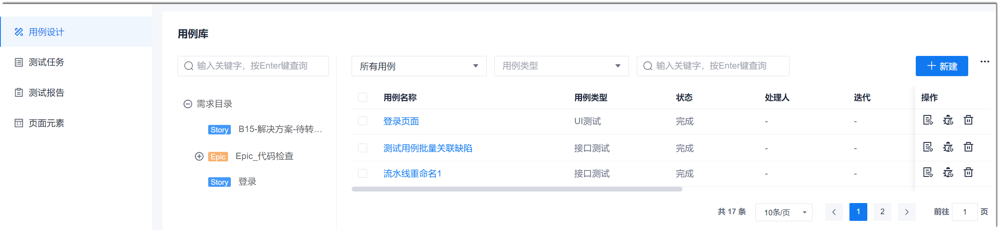
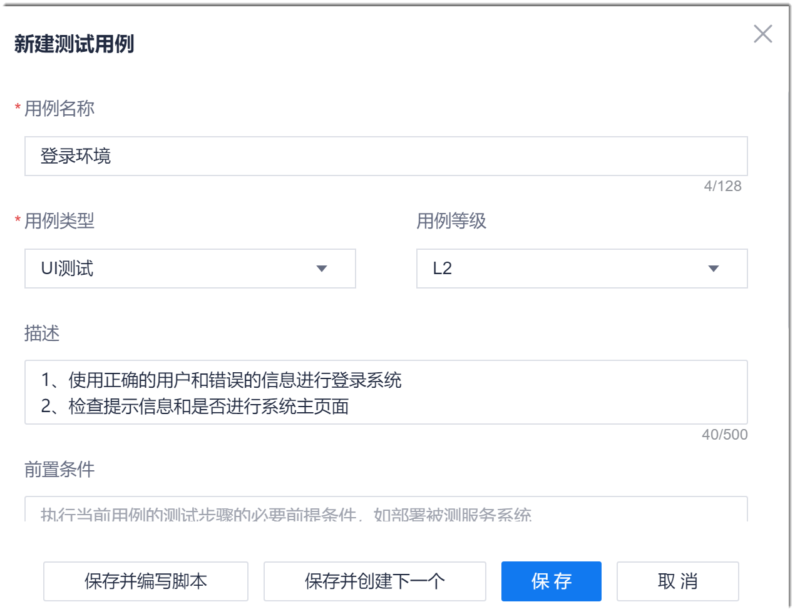

# 创建UI测试用例

### 操作步骤
1. 在项目顶部菜单栏中，单击“测试”。          
    进入测试管理界面。          
2. 在左侧导航栏中，单击“用例设计”。           
     右侧界面显示测试用例库。             
     

3. 在用例库界面右上角，单击“新建”。
4. 设置用例基本信息。            
     在“新建测试用例”对话框中，按照下表的指导，配置相关参数，单击“保存并编写脚本”、“保存并创建下一个”或“保存”。            
     
     <table>
<tr>
    <th>参数</th>
    <th>说明</th>
</tr>
<tr>
    <td>用例名称 </td>
    <td>支持3~128个字符。</td>
</tr>
<tr>
    <td>用例类型</td>
    <td>包括UI测试、接口测试和功能测试。本章节选择“UI测试”。</td>
</tr>
<tr>
    <td>描述</td>
    <td>描述当前测试用例的测试范围、测试目标、测试策略、测试方法、测试工具、测试数据、测试指标、测试环境等。</td>
</tr>
<tr>
    <td>前置条件</td>
    <td>执行当前用例的必备前提条件。</td>
</tr>
<tr>
    <td>测试步骤</td>
    <td>描述具体的测试操作步骤。</td>
</tr>
<tr>
    <td>预期结果</td>
    <td>描述本测试用例测试结束后预期结果，用于检查测试结果是否与预期相符。</td>
</tr>
<tr>
    <td>用例等级</td>
    <td>请根据用例对应场景或功能的重要程度选择用例等级：<ul><li>  L0：最基本的功能验证，用例不宜过多，各模块尽量保证在10-20个，占比5%左右。</li><li>L1：基本功能验证，可用于继承特性的基本功能验证、迭代验收前的基本功能验证等，占比20%左右。</li><li>L2：重要特性验证，可用于测试版本（非回归版本）中功能测试，占比60%左右。</li><li>L3：一般功能//非重要功能验证，包括对基本/重要功能的异常测试，占比15%～20%左右。</li><li>L4：非常特殊输入、场景、阈值条件的用例，该级别用例不宜过多，占比0%～5%左右。</li></ul></td>
</tr>
<tr>
    <td>迭代</td>
    <td>设置本用例所属的迭代。</td>
</tr>
<tr>
    <td>处理人</td>
    <td>选择用例的下一步处理人。</td>
</tr>
<tr>
    <td>关联需求</td>
    <td>选择本用例对应功能的需求。</td>
</tr>
<tr>
    <td>保存并编写脚本</td>
    <td>保存当前用例，并进入脚本编写界面。</td>
</tr>
<tr>
    <td>保存并创建下一个</td>
    <td>保存当前用例，自动打开下一个用例的新建界面。</td>
</tr>
</table>
     

