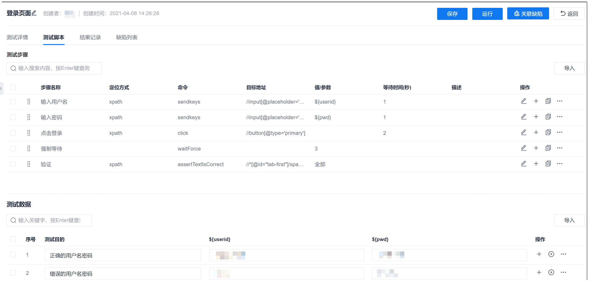
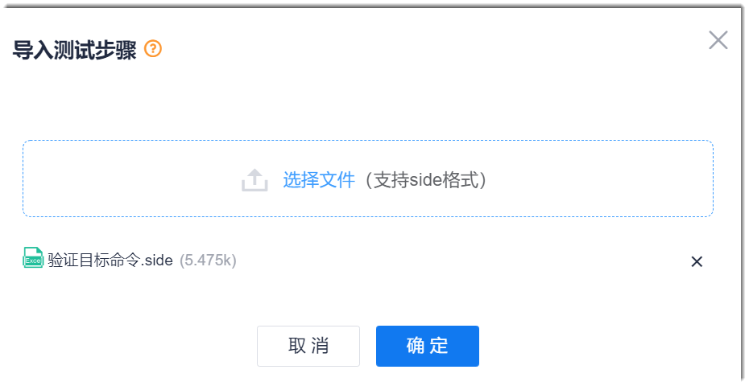
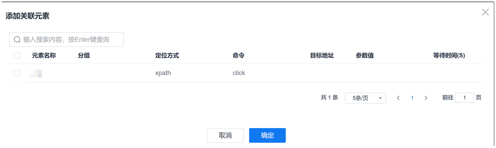
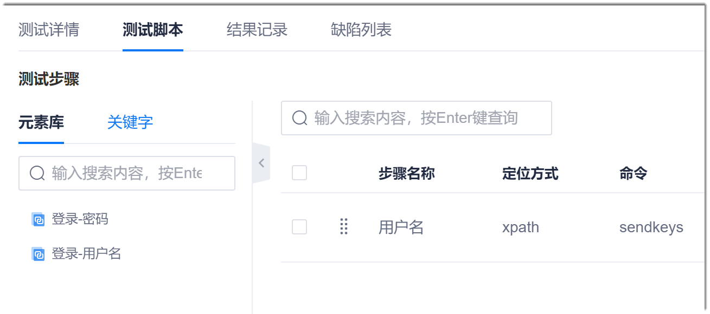
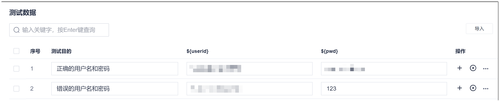
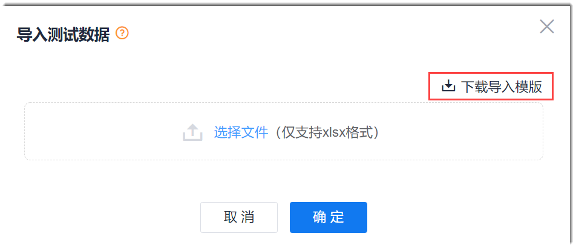
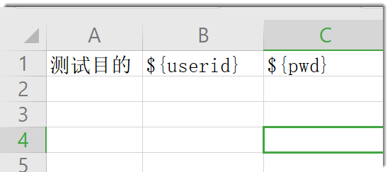
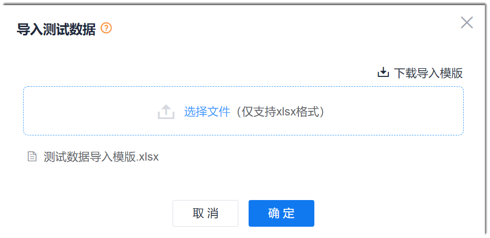

# 编写UI测试脚本

UI测试用例创建完成后，可以根据实际情况确定是否需要编写用例脚本，实现自动化测试。

### 背景信息             
在[创建UI测试用例](11.2.1.1-create-ui-test-case.md)的对话框中，中单击“保存并编写脚本”可直接进入脚本编写界面。单击其它按钮后，可以在用例库中单击用例名称，然后单击“测试脚本”进入脚本编写界面。           
UI测试脚本的步骤支持在线创建、导入和从已配置好的[页面元素](11.2.1.5-manage-page-element.md)中添加。

### 操作步骤
1. 进入脚本编写界面。                       
  在[创建UI测试用例](11.2.1.1-create-ui-test-case.md)的“新建测试用例”对话框中，单击“保存并编写脚本”可直接进入脚本编写界面。单击其它按钮后，可以在用例库中单击用例名称，然后单击“测试脚本”进入脚本编写界面。                    
  
       
2. 编写测试步骤。                           
     您可以在界面中直接编写步骤。如果步骤较多，您也可以在本地编写selenium IDE录制的side文件，然后导入到系统中。如果需要创建的步骤已在[页面元素](11.2.1.5-manage-page-element.md)中添加，您可以直接关联页面元素，快速创建步骤。
     
     **界面编写步骤：**       
     在“测试步骤”区域中，单击，编辑当前步骤；或者单击，新增并编写步骤。步骤参数说明如下表所示。步骤编写完成后，需单击，确认步骤。
     
     
     <table>
<tr>
    <th>参数</th>
    <th>说明</th>
</tr>
<tr>
    <td>步骤名称 </td>
    <td>支持2~50个非空格字符。</td>
</tr>
<tr>
    <td>定位方式</td>
    <td>选择定位到界面位置的方式。</td>
</tr>
<tr>
    <td>命令</td>
    <td>选择执行操作的命令。例如，需要输入信息，则选择“sendkeys”。</td>
</tr>
<tr>
    <td>目标地址</td>
    <td>根据定位方式，输入定位到元素的表达式。例如，定位方式采用XPath，则采用XPath的元素定位表达式。</td>
</tr>
<tr>
    <td>值/参数</td>
    <td>值是一种测试数据。根据命令确定是否需要设置值。值可以直接指定（适用于一个步骤只需要输入一个测试数据的场景），也可以通过参数的形式获取（适用于对于同一个步骤需要输入多个测试数据的场景）。
采用参数获取值时，使用“${<i>自定义参数名称</i>}”的方式。在此处自定义参数后，界面下方显示“测试数据”区域，用于设置各场景下各参数的取值。
</td>
</tr>
<tr>
    <td>等待时间（秒）</td>
    <td>表示执行此步骤后，是否需要等待一定时间再执行下一个步骤。不设置，表示不等待。</td>
</tr>
<tr>
    <td>描述</td>
    <td>对当前测试的步骤的描述。</td>
</tr>
<tr><td>操作</td>
    <td><ul><li>：确认此测试步骤。步骤编辑过程中显示此按钮。</li><li>：编辑此测试步骤。新增步骤或确认步骤后显示此按钮。</li><li>：在此步骤下，新增一个步骤。</li><li>：基于此步骤，在此步骤下，新增一个步骤。</li><li>  > 禁用：步骤在启用状态下时显示此按钮。在执行用例时，将不执行被禁用的步骤。</li><li> > 启用：步骤在禁用状态下时显示此按钮。取消步骤禁用。</li><li> > 删除：删除此步骤。</li></td>
</tr>
</table>
> [!NOTE]
> 测试步骤按照显示顺序串行执行。拖动步骤到合适的位置，可以修改步骤的执行顺序。

  **导入步骤：**
  1. 在“测试步骤”区域右上方，单击“导入”。
  2. 在弹出的“导入测试步骤”对话框中，单击“选择文件”，选择包含测试步骤的side文件，单击“确定”。        
         

  **从元素库中添加：**    
  系统支持统一[管理页面元素](11.2.1.5-manage-page-element.md)。您可以任选一种方式将元素库中的元素添加到步骤中：
  * 方式一
    1. 在“测试步骤”区域右上方，单击“添加关联元素”。
    2. 在弹出的“添加关联元素”对话框中，选中要添加的元素，单击“确定”。        
          

  * 方式二
    1. 在“测试步骤”区域左侧，单击，显示元素库。       
     
    
    2. 将元素库中的元素拖动到步骤区域中。       
      对于同一个元素，您可以多次添加到步骤中。新添加的元素默认放在第1位。您可以拖动步骤，调整位置。

3. （可选）设置测试数据。                   
  如果在测试步骤的“值/参数”中，使用参数，则系统会在测试步骤下方显示“测试数据”区域，用于设置多种场景下各参数的值。                     
  您可以直接在界面中填写测试数据。如果数据较多，您也可以下载数据填写模板，在本地填写完成后导入系统中。                  
  
  
  **界面填写数据：**               
  界面填写测试数据的说明如下表所示。
  
  <table>
<tr>
    <th>参数</th>
    <th>说明</th>
</tr>
<tr>
    <td>测试目的 </td>
    <td>测试数据适用的场景</td>
</tr>
<tr>
    <td><i>步骤中引用的参数</i></td>
    <td>例如在步骤的“值/参数”中，填写“${userid}”，则此处显示“${userid}”。 在此场景下的定义参数取值。如果步骤中定义了多个参数，后续列将继续显示定义的参数。</td>
</tr>
<tr><td>操作</td>
    <td><ul><li>：在此数据下，新增一条数据。</li>
    <li>：采用此条数据，执行用例。</li><li> > 复制：基于此条数据，在此条数据下，新增一条数据。</li><li> > 禁用：数据在启用状态下时显示此按钮。在执行用例时，将不代入被禁用的数据。</li><li> > 启用：数据在禁用状态下时显示此按钮。取消数据禁用。</li><li> > 删除：删除此条数据。</li></td>
</tr>
</table>
  
  **导入数据：**
  1. 在“测试数据”区域中，输入1条“测试目的”，单击右上方的“保存”。
  2. 在“测试数据”区域右上方，单击“导入”。
  3. 在弹出的“导入测试数据”对话框中，单击“下载导入模板”。                          
                     
  4. 打开导入模板，根据上方表格的描述，填写数据并保存文档。                      
                            
  5. 返回系统的“导入测试数据”对话框，单击“选择文件”，选择填好数据的模板文档，单击“确定”。                      
                         
  返回测试脚本界面，“测试数据”区域中填充了模板中的测试数据。                    
4. 测试步骤和测试数据均配置完成后，单击界面右上方的“保存”。
          