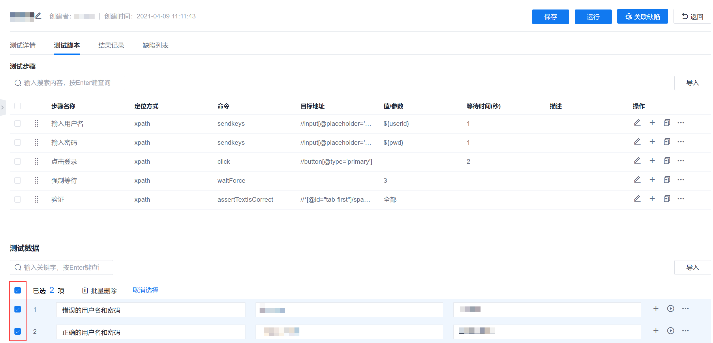
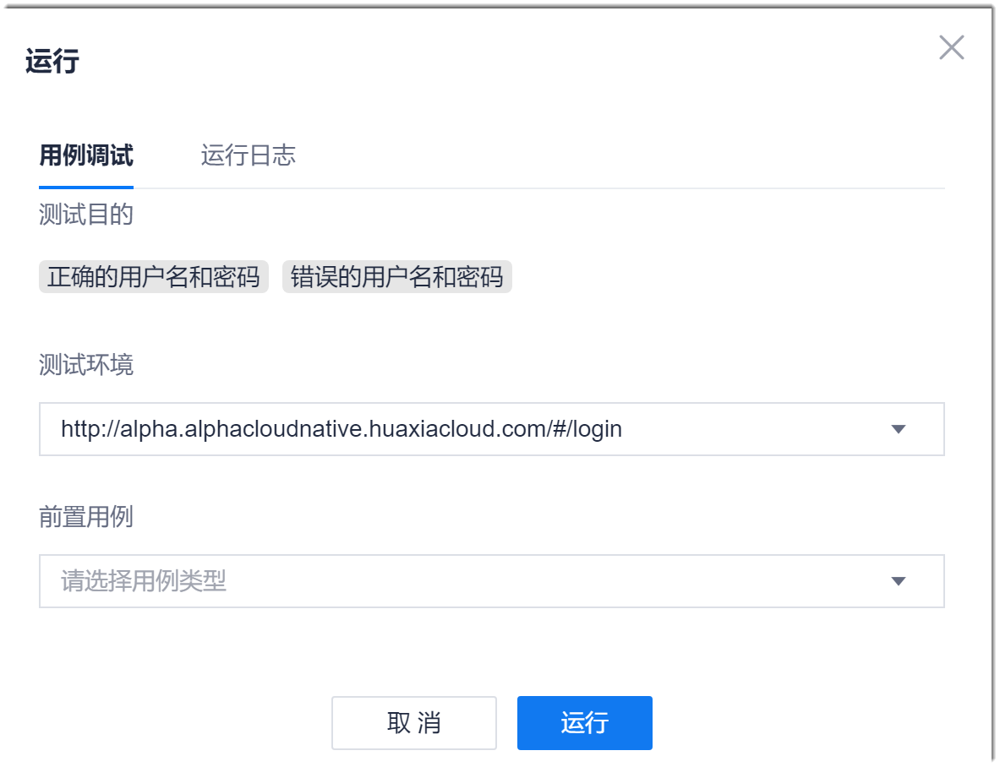
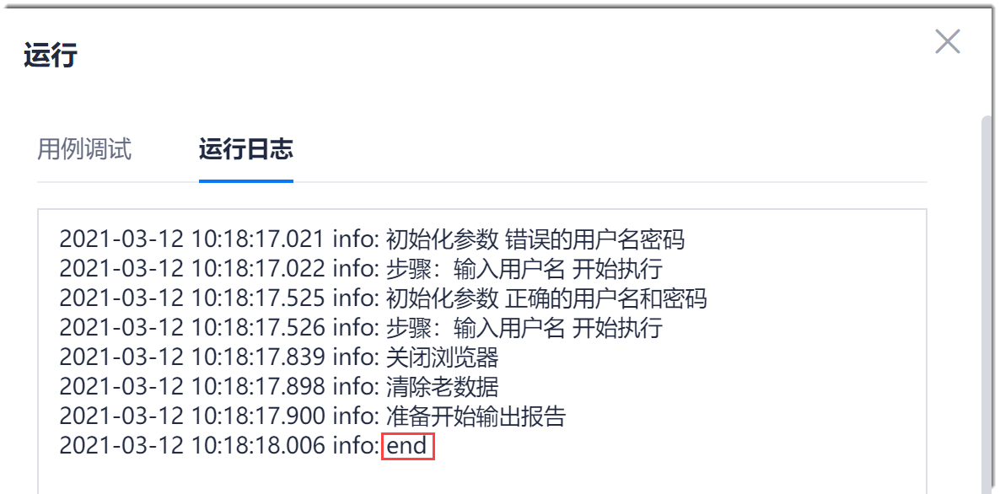

# 执行UI测试用例

UI测试用例和脚本编写完成后，您可以执行一次用例，验证用例是否可以正常执行，并调试用例。您也可以在需要的时候，随时执行用例。

### 操作步骤

* **全数据执行用例。**
  1. 在用例库界面中，单击用例名称，进入用例详情界面。
  2. 单击“测试脚本”页签。
  3. 如果有测试数据，在界面下方选中需要执行的测试数据，然后在界面右上方，单击“运行”。                   
    
           
  4. 在弹出的“运行”对话框中，输入“测试环境”，即测试界面的URL，并根据需要设置“前置用例”，单击“运行”。
> [!NOTE]
> 输入测试环境后，系统会在缓存中保存测试环境，作为下拉列表，便于下次测试直接使用。清理缓存后，保存的测试环境会被清除。
        
                             
   对话框跳转到“运行日志”页签，显示用例的运行进展。当显示“end”时，表示用例执行完成。关闭对话框，然后[查看UI测试用例执行结果](11.2.1.4 查看UI测试用例执行结果.html)。                         
   

* **使用某条数据执行用例。**
  1. 在用例库界面中，单击用例名称，进入用例详情界面。
  2. 单击“测试脚本”页签。
  3. 在界面下方单击数据后面的，采用该条数据执行用例。
  4. 在弹出的“运行”对话框中，输入“测试环境”，即测试界面的URL，并根据需要设置“前置用例”，单击“运行”。
> [!NOTE]
> 输入测试环境后，系统会将测试环境保存为下拉列表，便于下次测试直接使用。
        
                                  
   对话框跳转到“运行日志”页签，显示用例的运行进展。当显示“end”时，表示用例执行完成。关闭对话框，然后[查看UI测试用例执行结果](11.2.1.4 查看UI测试用例执行结果.html)。                  
   
