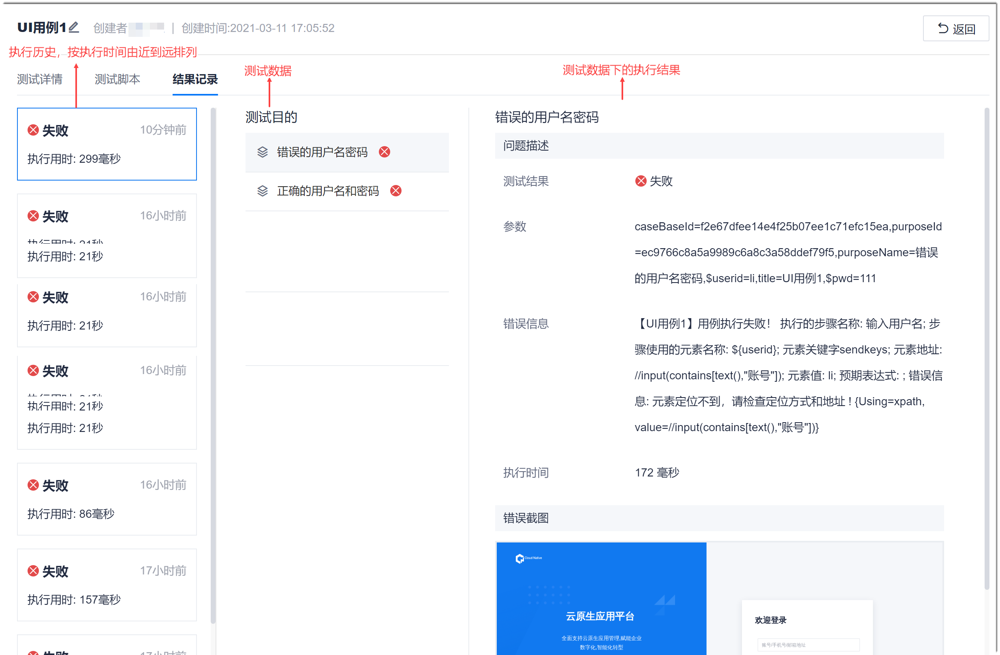

# 查看并处理UI测试用例执行结果

测试用例执行完成后，您可以查看用例执行结果，确认是否符合预期。如果不符合预期，可以按照结果提示，修改用例。           
执行结果保留历史执行的结果。

### 操作步骤
1. 在用例库页面中，单击用例名称，进入用例详情页面。
2. 单击“结果记录”页签。                           
     默认显示最近一次执行的第一条测试数据的执行结果。                           
                                 
3. （可选）如果执行结果不符合预期，判断是测试脚本的问题还是应用软件的实现问题：
  * 测试脚本的问题：根据错误提示信息，检查并修改脚本错误。
  * 应用软件的实现问题：在项目的“工作事项”或“迭代冲刺”中，创建“缺陷”类型的工作项，用于跟踪问题的解决进展。缺陷创建完成后，建议您[关联缺陷](11.2.6 用例关联缺陷.html)，便于追踪需求的交付。

