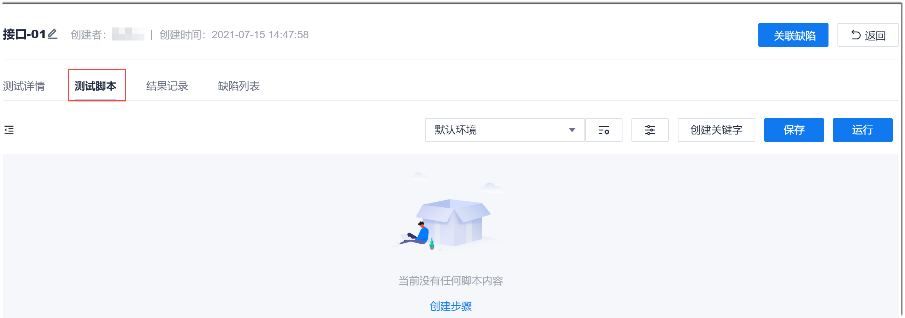
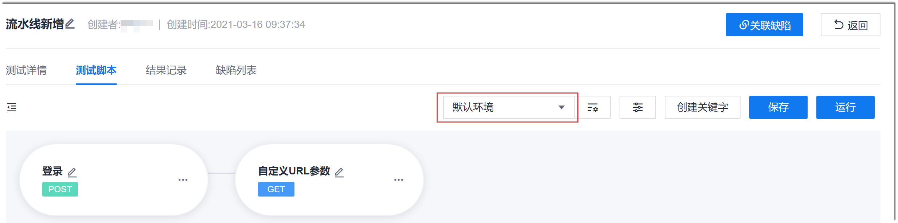
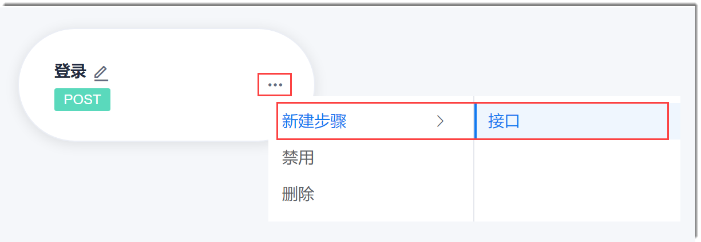
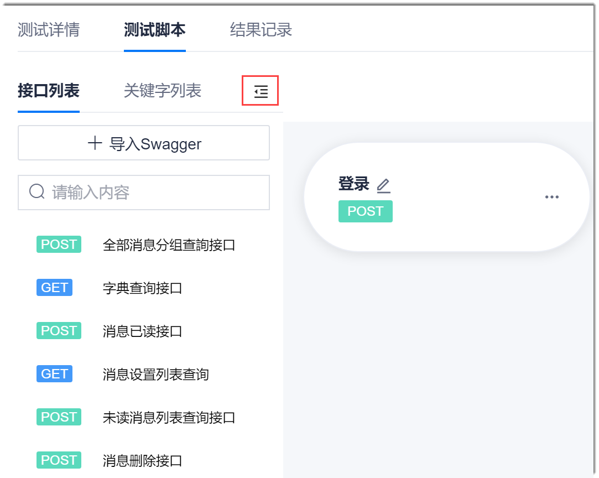
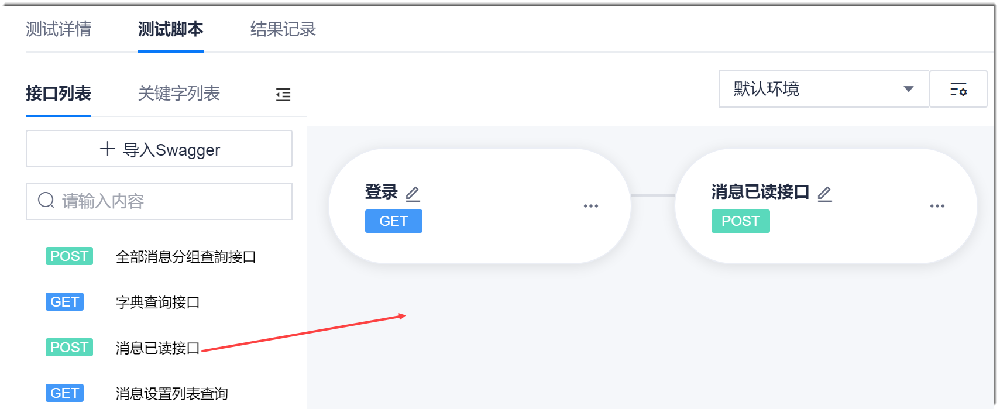
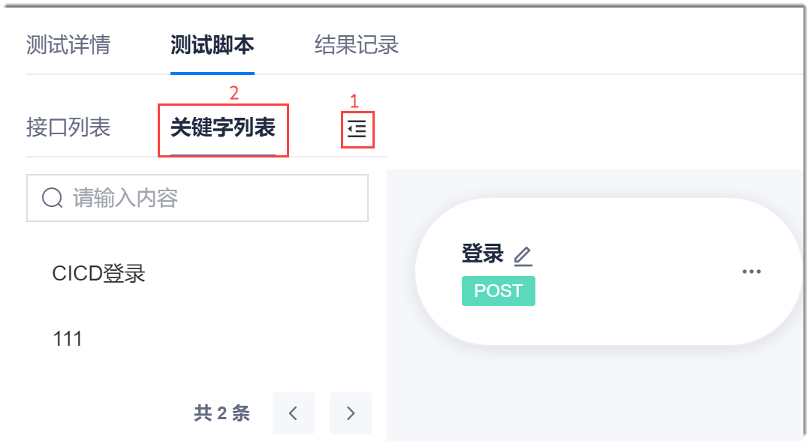
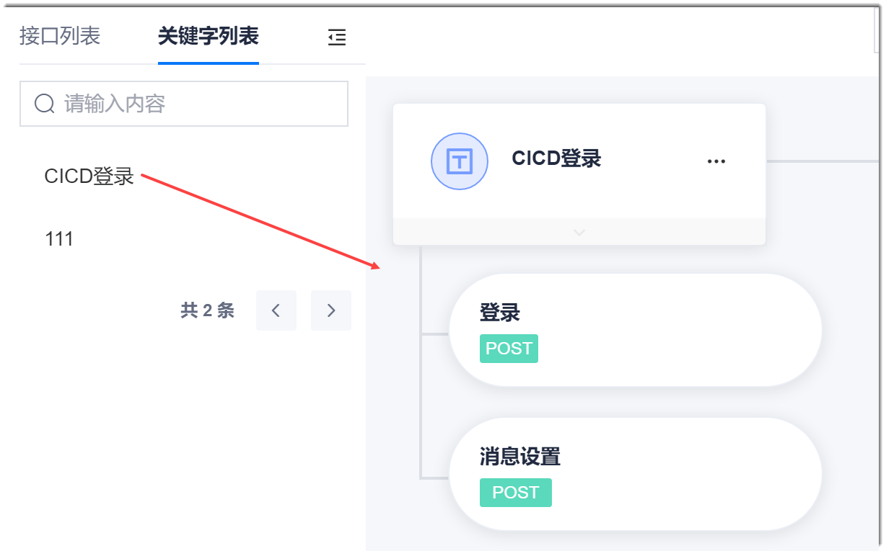
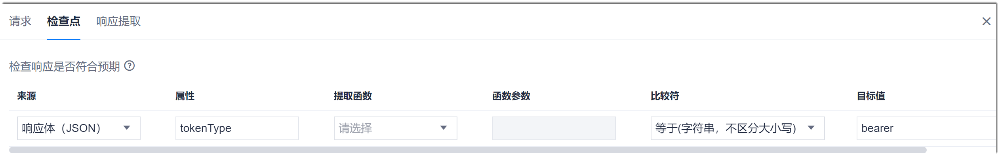
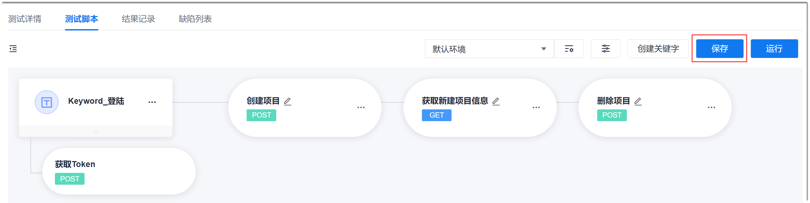

# 编写接口测试脚本

接口测试用例创建完成后，可以根据实际情况确定是否需要编写用例脚本，实现自动化测试。           
在[创建接口测试用例](11.2.2.1-create-api-test-case.md)的对话框中，中单击“保存并编写脚本”可直接进入脚本编写界面。单击其它按钮后，可以在用例库中单击用例名称，然后单击“测试脚本”进入脚本编写界面。

### 前置准备
接口测试脚本可以由一个或多个步骤组成，您需要编写步骤的测试脚本，并将各步骤合理编排。            
在编写接口测试脚本的步骤前，您可以执行以下操作，便于在测试脚本步骤中引用对应的内容：
* （可选）导入Swagger                   
    用于生成标准化的脚本模板。在此脚本模板的基础上，可以可视化编排测试脚本的步骤。详见[导入Swagger文件](11.2.2.2.4-import-swagger.md)。                 
* （必选）配置全局参数                  
   全局参数定义测试环境和项目内共享的测试数据（参数）。详见[设置全局参数](11.2.2.2.6-set-global-parm.md)。                
* （可选）配置局部参数                        
   局部参数定义本用例内共享的测试数据（参数）。详见[设置局部参数](11.2.2.2.7-set-partial-parm.md)。                 
* （可选）配置关键字                          
   关键字用于封装常用测试逻辑，即将一个或多个测试步骤封装为一个关键字，可以被测试步骤调用。 详见[设置关键字](11.2.2.2.5-set-keyword.md)。

### 编写脚本                  
1. 进入脚本编写界面。                        
      在[创建接口测试用例](11.2.2.1-create-api-test-case.md)的“新建测试用例”对话框中，单击“保存并编写脚本”可直接进入脚本编写界面。单击其它按钮后，可以在用例库中单击用例名称，然后单击“测试脚本”进入脚本编写界面。
                     
2. 选择测试环境。
    在测试脚本界面中，选择测试环境。                       
    环境来源于[全局参数](11.2.2.2.6-set-global-parm.md)。                            
                            
3. 创建测试步骤。                          
   创建测试步骤可以通过如下几种方式：
  * **创建空白步骤**
    * 如果当前脚本没有任何步骤，单击界面中的“创建步骤”。                           
                            
    * 如果已有步骤，单击步骤右侧的“ > 新建 > 接口”。                               
                                  
  * **通过Swagger文件导入的步骤创建**         
    1. [导入Swagger文件](11.2.2.2.4-import-swagger.md)后，接口列表会显示Swagger文件中定义的接口。单击左侧的，可显示接口列表和关键字列表。                    
                                  
    2. 从接口列表中，拖动接口到步骤区域。                          
                                 
  * **通过创建的关键字创建**
    1. [设置关键字](11.2.2.2.5-set-keyword.md)后，关键字列表会显示已有的关键字。单击左侧的，然后单击“关键字列表”页签。                       
                               
    2. 从关键字列表中，拖动关键字到步骤区域。                      
                                  
4. 修改步骤名称。                     
  单击步骤名称后面的，然后输入新名字，在其它地方单击鼠标左键，保存设置。其中，步骤名称在同一用例内需唯一。                    
5. 单击步骤名称，进入步骤编辑界面。
6. 配置步骤请求信息。                   
     在脚本步骤编辑界面中，单击“请求”页签。详细配置请参见[设置接口请求](11.2.2.2.1-set-api-request.md)。                       
7. （可选）配置步骤检查点。       
     在脚本步骤编辑界面中，单击“检查点”页签，参见[设置检查点](11.2.2.2.2-set-check-point.md)，配置检查点。        
        
8. （可选）配置响应提取。      
  响应提取是将接口响应结果的某一部分提取出来命名为参数，供当前用例的后续步骤调用。如果需要在本接口中提取参数，则在脚本步骤编辑界面中，单击“响应提取”页签，参见[设置响应提取](11.2.2.2.3-set-response-extract.md)。
9. 根据步骤3~步骤8，完成所有测试步骤的配置。所有步骤配置完成后，在“测试脚本”界面中，单击“保存”，保存脚本。     
    

 

