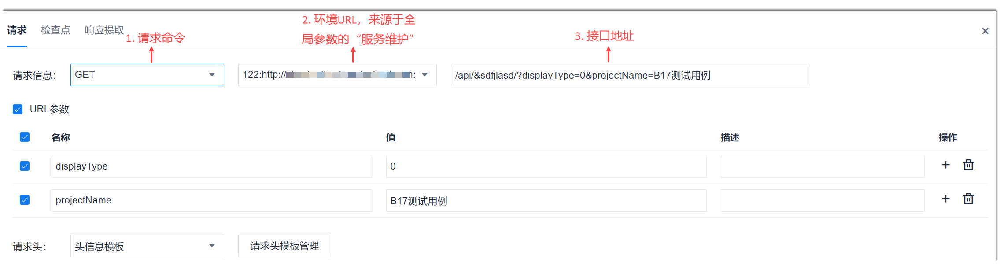
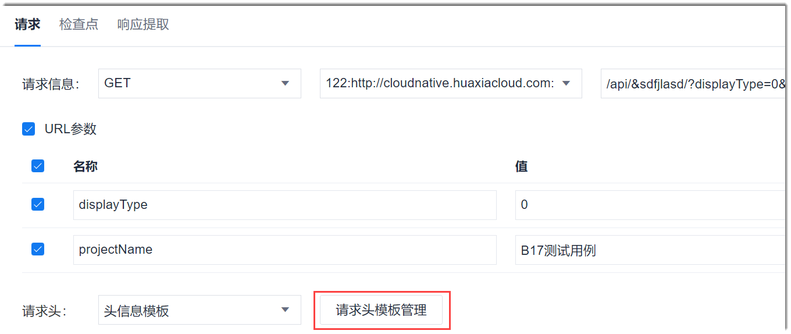
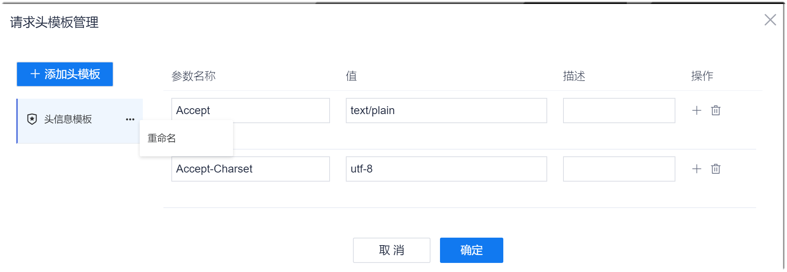
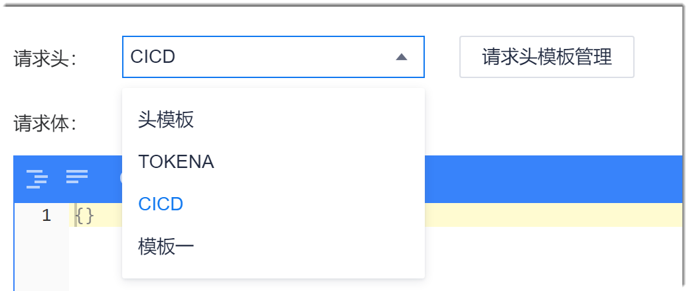
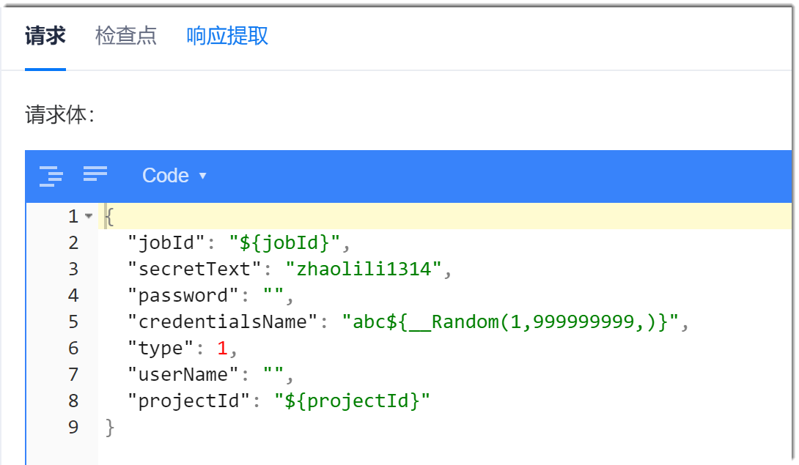

# 设置接口请求

在步骤编辑界面中，单击“请求”页签，设置请求信息。请求信息包含请求信息、请求头和请求体三个部分。

### 请求信息          
请求信息表示对某个接口执行什么命令。从左到右依次为：
1. 需执行的请求命令。
2. 环境的URL，取值来源于全局参数中的“服务维护”，格式为“_服务名_:_协议_://_域名_:_端口号_”。
3. 接口地址，除去环境URL后的接口地址。
          

接口地址中，您可以采用参数调用的方式填写。参数段前后均以“?”识别。第一个参数前面以“?”识别，后续参数前面以“&”识别。参数应用到接口地址中后的格式为“?_参数1名称_=_参数1值_&_参数2名称_=_参数2值_?”。             

接口地址采用参数调用的方式填写后，系统在下方显示“URL参数”区域，如上图所示。“URL参数”是接口地址参数化应用。勾选参数后，“名称”和“值”会应用到接口地址中。           
无论在接口地址中编辑参数，还是在参数中编辑参数，两者都会同步。               
各参数的说明如下表所示。

<table>
<tr>
    <th>参数</th>
    <th>说明</th>
</tr>
<tr>
    <td>名称 </td>
    <td>自动获取接口地址中“?”到“=”或“&”之间的字符作为参数名称。</td>
</tr>
<tr>
    <td>值</td>
    <td>赋予接口地址参数取值。可以直接输入取值，也可以引用参数：<ul><li>全局非动态参数和响应提取的参数：引用方式为“${<i>全局参数名称</i>}”</li><li>全局动态参数：引用方式为“@{<i>全局参数名称</i>}”</li><li>局部参数：引用方式为“#{<i>局部参数名称</i>}”</li></ul>引用参数时，输入任意一个符号，均会显示所有可引用的参数。其中，如果响应提取参数无法提取到值，则不会显示。</td>
</tr>
<tr>
    <td>描述</td>
    <td>对此参数的描述信息。</td>
</tr>
<tr>
    <td>操作</td>
    <td>：在下面增加一个参数。 ：删除本参数。</td>
</tr>

</table>

#### 请求头          
系统给服务器发送请求的时候需要请求头。请求头是一组“key:value”的键值对。
* 请求头模板管理                       
  1. 在“请求头”后面单击“请求头模板管理”。     
       
  2. 弹出“请求头模板管理”对话框，可以新增、修改头模板，新增、修改、删除头信息的键值对。
    

* 选择请求头模板                   
    设置请求头模板后，返回请求配置界面，在请求头下拉框中选择需要使用的请求头模板。                     
     

### 请求体                 
当请求命令为非“GET”命令时，显示“请求体”；当请求命令为“GET”时，不会显示“请求体”。               
请求体是接口请求需要传递的消息（报文），当前仅支持JSON格式。              

