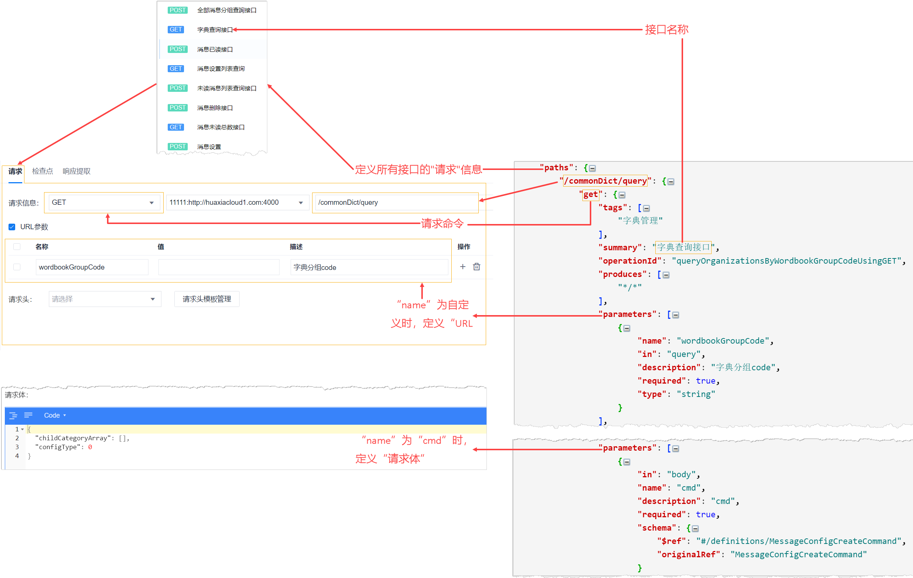
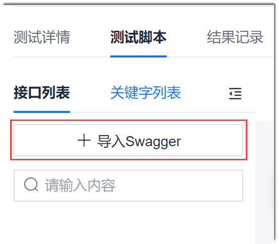
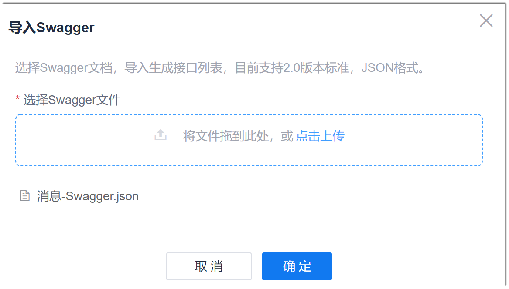
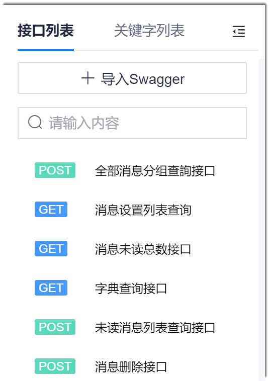

# 导入Swagger文件

Swagger是一个定义、开发、调试RESTful等接口的工具，应用Swagger可以标准化地定义接口属性，便于互联互通。               
系统当前支持2.0版本标准，JSON格式。

### 背景信息
接口测试支持导入Swagger格式的接口描述文件、解析接口的定义描述、生成脚本的步骤模板。一个脚本步骤模板对应Swagger中的一个接口定义。在脚本步骤模板中，输入接口的URL参数就可以创建接口测试脚本的步骤。您可以基于脚本步骤模板可视化编排测试脚本。

脚本步骤与Swagger文件中的字段对应关系如下图所示。详细的Swagger文件结构请参见[Swagger官方文档](https://swagger.io/docs/specification/2-0/basic-structure/)。                   

### 操作步骤
1. 在测试脚本界面中，单击，显示接口列表和关键字列表。                        
                                   
2. 单击“接口列表”页签下的“导入Swagger”。                         
                                
3. 在弹出的“导入Swagger”对话框中，选择Swagger文件，或者将Swagger文件拖入到文件框中，单击“确定”。                                    
                    
    
导入成功后，接口列表中，显示Swagger文件中定义的接口。                      
您可以在拖动接口到步骤编辑区域中，编排并设置步骤。       

