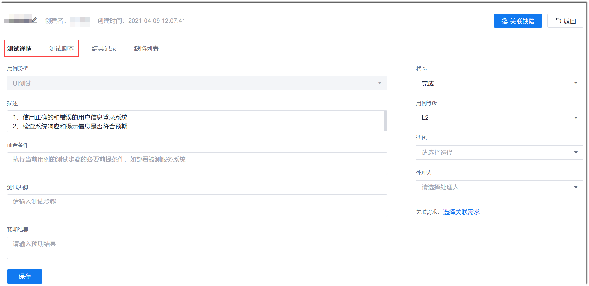
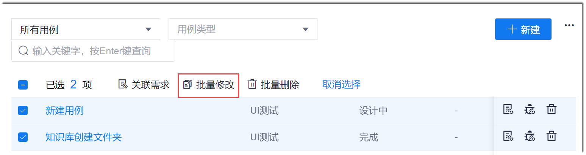
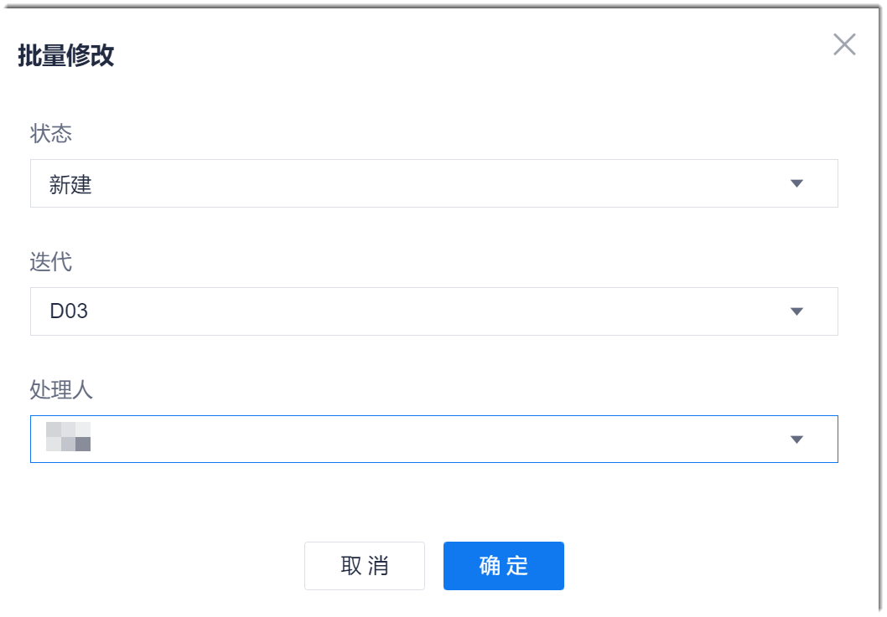
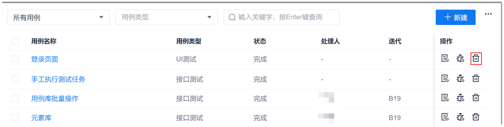

# 修改/删除测试用例

为了保障系统数据的整洁性，对于不适用或不再使用的测试用例，需及时修改为适用的用例，或者删除用例。

### 修改测试用例
**修改单个测试用例**               
修改单个测试用例可以修改除用例类型外的所有信息。        
1. 在用例库页面中，单击用例名称，进入用例详情页面。
2. 在用例详情页面的“测试详情”页签中，修改用例的基本信息。对于UI测试和接口测试，您还可以单击“测试脚本”页签，修改测试脚本。修改完成后，单击“保存”。                              
     

**批量修改测试用例**                 
批量修改测试用例只能修改用例的“状态”、“迭代”和“处理人”。          
1. 在用例库页面中，选中测试用例，单击上方显示的“批量修改”。   
  
2. 在弹出的“批量修改”对话框中，设置参数，单击“确定”。     
  

### 删除测试用例                     
测试用例被测试任务引用时，不能删除用例。                                   
**删除单个测试用例**
1. 在用例库页面中，单击用例“操作”列的。           
      
2. 在弹出的确认对话框中，单击“确定”。

**批量删除测试用例**
1. 在用例库页面中，选中测试用例，单击上方显示的“批量删除”。    
  
2. 在弹出的确认对话框中，单击“确定”。

