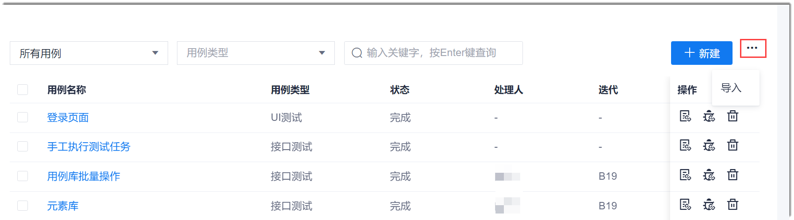
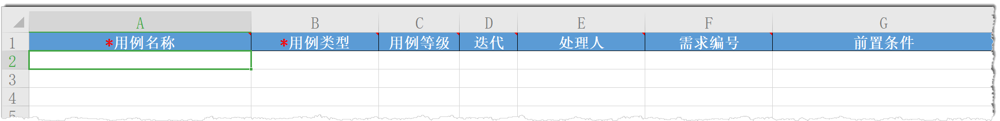

# 导入测试用例

除了可以在CAP的系统页面上创建测试用例外，您还可以将本地的测试用例按照模板填写完整后，导入系统中。                       
导入测试用例只能导入用例基本信息部分，不能导入测试脚本。

### 操作步骤
1. 在用例库页面的右上方，单击“ > 导入”。
                
2. 在弹出的“导入用例”对话框中，单击“下载导入模版”。
                  
3. 打开模板，填写用例信息，然后保存并关闭文档。
              
4. 返回“导入用例”对话框中，单击“选择文件”或将文件拖拽到“选择文件”框中，单击“确定”。
  
