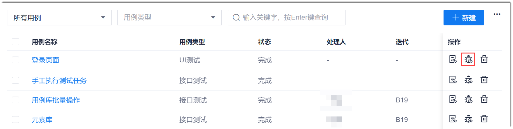
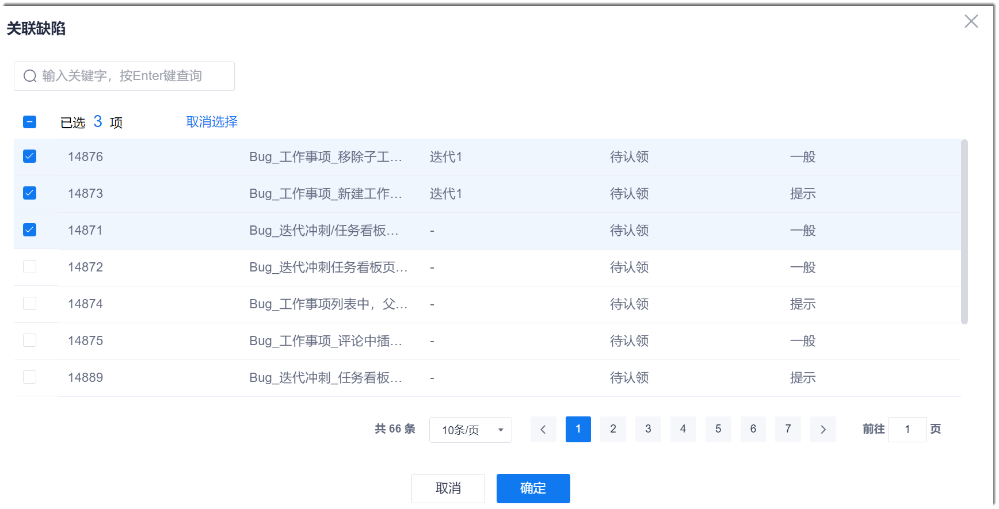
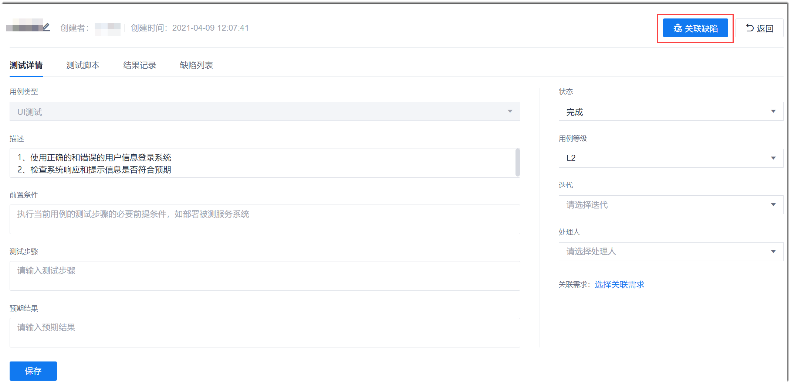

# 用例关联缺陷

如果通过测试用例发现了系统缺陷，您需要创建缺陷类型的工作项用于跟踪缺陷的修复情况。同时，为了使缺陷可追溯，您可以关联用例和缺陷。

### 操作步骤                 
您可以通过以下两种方式关联缺陷：
* **通过用例库关联缺陷**
  1. 在用例库页面中，单击用例“操作”列的。
           
  2. 在弹出的“关联缺陷”对话框中，选择一个或多个相关联的缺陷，单击“确定”。
    
  
* **通过用例详情关联缺陷**
  1. 在用例库页面中，单击用例名称，进入用例详情页面。
  2. 单击右上方的“关联缺陷”。
               
  3. 在弹出的“关联缺陷”对话框中，选择一个或多个相关联的缺陷，单击“确定”。

缺陷关联成功后，在用例库页面中，用例的“缺陷”列会显示“已关联”。已关联的缺陷可以通过在用例详情页面中，单击“关联缺陷”查看。

