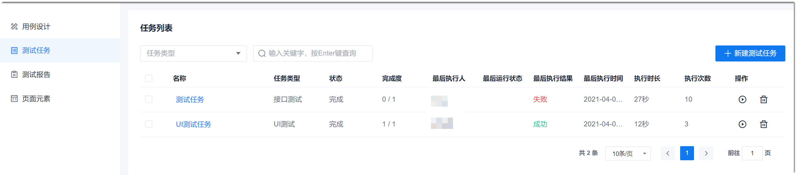
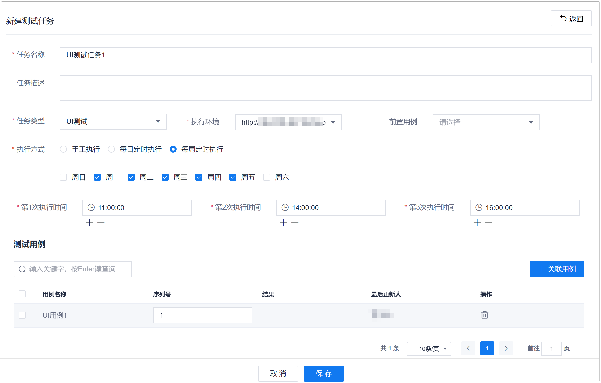
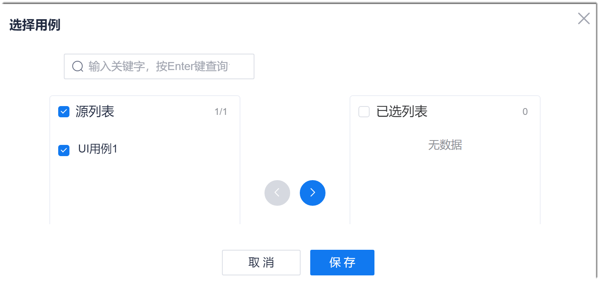

# 创建测试任务

测试任务只能针对某一类测试创建，不能多种测试类型混合创建一个测试任务。例如，可以创建接口测试任务，任务中只包含接口测试用例；不能创建一个既包含接口测试用例和UI测试用例的测试任务。

### 操作步骤
1. 在项目顶部菜单栏中，单击“测试”。
2. 在左侧导航栏中，单击“测试任务”。           
     右侧显示任务列表。            
3. 在任务列表右上方，单击“新建测试任务”。          
              
4. 在“新建测试任务”对话框中，根据下表的描述进行设置。设置完成后，单击“保存”。
     

 

  <table>
<tr>
    <th>参数</th>
    <th>说明</th>
</tr>
<tr>
    <td>任务名称 </td>
    <td>支持3~128个非空格字符。</td>
</tr>
<tr>
    <td>任务描述</td>
    <td>支持0~500个字符。</td>
</tr>
<tr>
    <td>任务类型</td>
    <td>包括UI测试、接口测试和功能测试。</td>
</tr>
<tr>
    <td>执行环境</td>
    <td>本参数在“任务类型”为“UI测试”、“接口测试”时显示：<ul><li>接口测试：环境从下拉列表中选择。下拉列表的取值来源于接口测试用例的测试脚本中的<a href="11.2.2.2.6 设置全局参数.html">全局参数</a>。</li><li>UI测试：环境可以直接输入测试界面的URL。输入测试环境后，系统会在缓存中保存测试环境，作为下拉列表，便于下次测试直接使用。清理缓存后，保存的测试环境会被清除。</li></ul></td>
</tr>
<tr>
    <td>前置用例</td>
    <td>本参数在“任务类型”为“UI测试”时显示。选择此任务的前置用例。设置后，在执行本任务前，会先执行前置用例。因此，执行环境需要适配前置用例的界面。如果前置用例的环境与执行用例的环境不一致，需要在用例的步骤中加上对应的操作。
有测试数据的用例不能作为前置用例，因此，不会在前置用例列表中显示。
</td>
</tr>
<tr>
    <td>执行方式</td>
    <td>功能测试只支持手工执行，UI测试和接口测试支持手工执行和定时自动执行。因此，本参数在“任务类型”为“UI测试”、“接口测试”时显示。包括手工执行、每日定时执行和每周定时执行。选择定时执行时，日期和时间都可以设置多个。其中时间可以设置不超过10个时间。</td>
</tr>
<tr>
    <td>测试用例</td>
    <td>单击“关联用例”，从源列表中，选中需要关联的用例，然后单击，移动到已选择列表中。全部关联完成后，单击“保存”。
如果需要去关联用例，在“测试用例”区域中，单击用例后面的。</td>
</tr>
</table>

