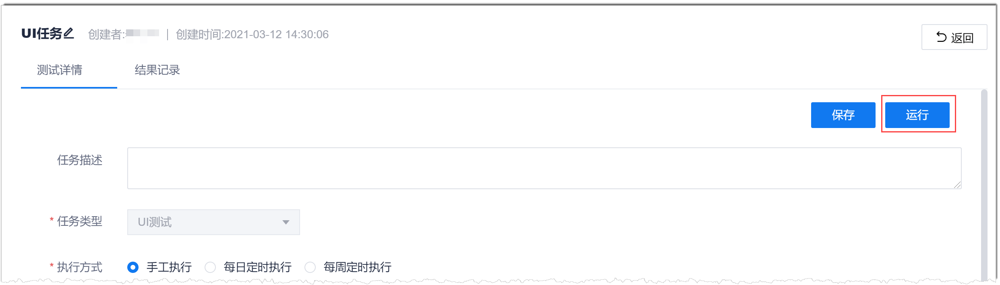
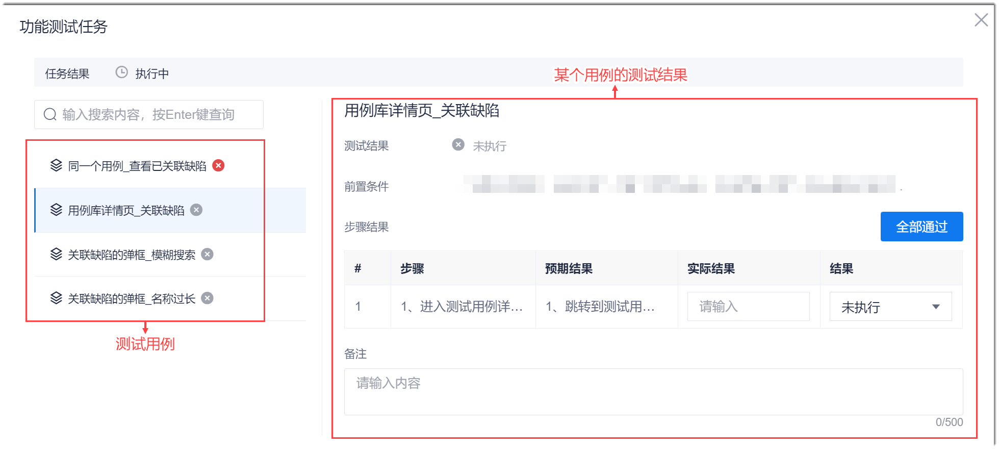

# 执行测试任务

对于UI测试任务和接口测试任务，您可以手动执行，也可以定时自动执行，还可以挂载到流水线中执行（详见[配置流水线接口测试步骤](12.3.4.2 接口测试.html)）。对于功能测试任务，您只能手动执行。                   
定时自动执行需要在测试任务中，将“执行方式”设置为“每日定时执行”或“每周定时执行”，然后设置执行时间。设置完成后，系统将按照设置的时间自动执行测试任务。                         
以下介绍手动执行测试任务的操作步骤。

### 手动执行测试任务                   
1. 可选择以下任一方式运行测试任务：                      
  * 在任务列表中运行                          
    在测试任务列表中，单击任务“操作”列的。                     
  * 在任务详情中运行
    1. 在任务列表中，单击测试任务名称，进入任务详情界面。
    2. 单击右上方的“运行”。                             
       
   
   对于接口测试和UI测试任务，系统自动执行测试脚本。您可以在测试详情的“测试用例”区域查看每个用例的执行情况，也可以在任务列表的“最后执行结果”中查看任务的执行情况。                      
   对于功能测试任务，还需手动执行测试步骤，请参见第2步。                              
2. （功能测试任务）手动执行用例，并填写执行结果。                                
    
    
  1. 在用例区域中，单击测试用例。
  2. 填写执行结果。     
        在右侧测试步骤中，根据测试步骤的描述执行测试，在“实际结果”中填写执行结果。   
  3. 填写测试结论。      
     将实际测试结果与预期结果对比：如果符合预期，则“结果”（即结论）为成功；如果不符合预期，则“结果”为失败。您可以任选一种方式设置实际执行的结论：
    * 设置单个步骤的执行结论：在步骤“结果”列中，设置最终步骤的执行结论。      
        当所有用例的“结果”为“成功”时，整个用例的执行结果为“成功”。
    * 批量设置所有步骤的执行结论：如果所有步骤均执行成功，则您可以单击步骤右上方的“全部通过”，一次性设置所有步骤的“结果”。
      
系统返回用例详情页面中，用例的“结果”显示为“成功”。
      
