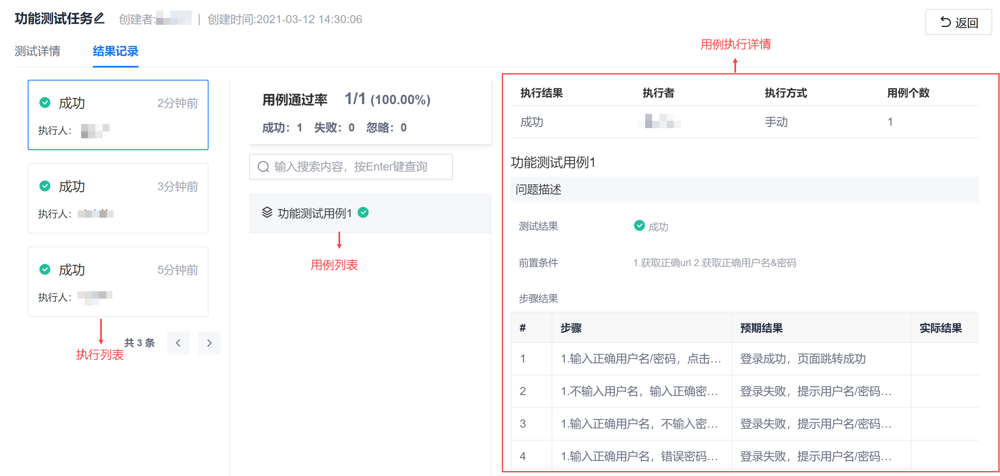
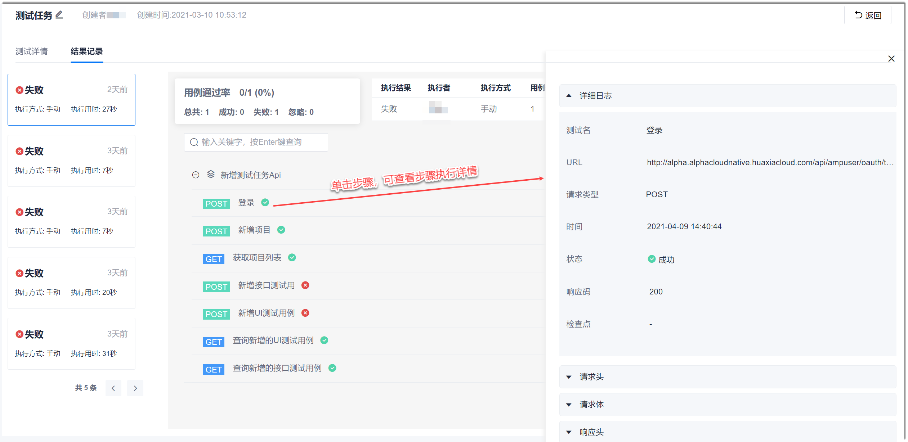

# 查看并处理执行结果

测试任务执行成功后，您可以在“执行结果”中查看每次执行的详情。

### 操作步骤
1. 在任务列表中，单击测试任务名称，进入任务详情页面。
2. 单击“结果记录”页签。                           
    显示每次的执行列表，默认显示最近一次执行的详情。下图为功能测试的执行结果记录。                            
          
    下图为接口测试任务的执行结果记录。UI测试任务的执行结果界面与接口测试任务类似。
                
3. （可选）如果执行结果不符合预期，判断是测试脚本的问题还是应用软件的实现问题：
  * 测试用例的问题：根据错误提示信息，检查并修改用例错误。
  * 应用软件的实现问题：在项目的“工作事项”或“迭代冲刺”中，创建“缺陷”类型的工作项，用于跟踪问题的解决进展。缺陷创建完成后，建议您[关联缺陷](11.2.6 用例关联缺陷.html)，便于追踪需求的交付。