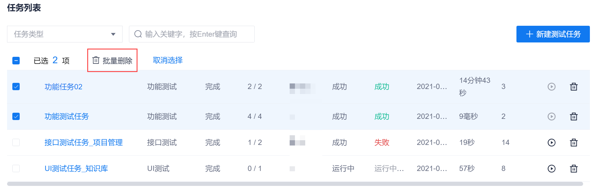

# 修改/删除测试任务
为了保障系统数据的整洁性，对于不适用或不再使用的测试任务，需及时修改为适用的任务，或者删除任务。

### 修改任务
1. 在测试任务列表页面中，单击任务名称，进入任务编辑页面。
2. 在任务编辑页面中，修改内容，单击“保存”。

### 删除任务
**删除单个测试任务**
1. 在测试任务列表页面中，单击任务操作列的。
2. 在弹出的确认框中，单击“确定”。

**批量删除测试任务**
1. 在测试任务列表页面中，选中需要删除的测试任务，单击上方显示的“批量删除”。    
  
2. 在弹出的确认对话框中，单击“确定”。
