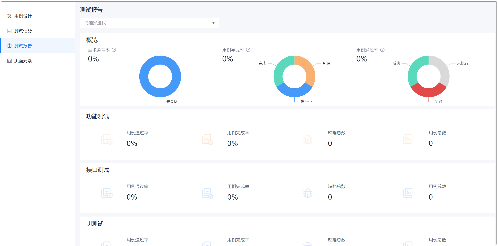
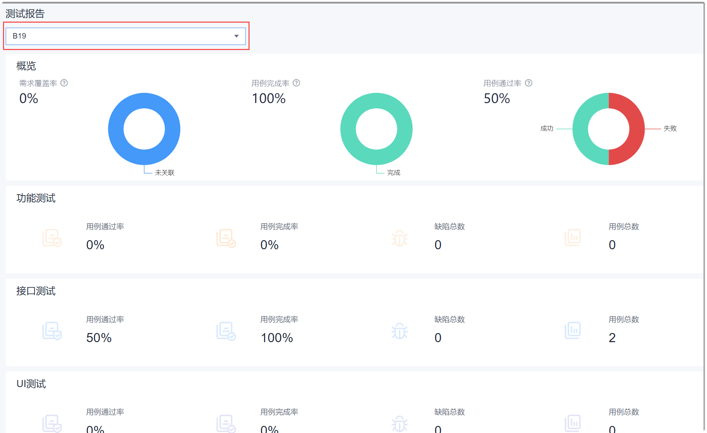

# 查看测试报告

质量报告展示整个项目的测试情况，包括需求覆盖率、用例完成率、用例通过率，以及各类测试（例如接口测试）的情况，包括用例通过率、用例完成率、缺陷总数、用例总数。

### 操作步骤
1. 在项目顶部菜单栏中，单击“测试”。
2. 在左侧导航栏中，单击“测试报告”。       
  右侧默认显示所有迭代的测试数据统计分析。         
  
3. （可选）查看某个迭代的测试数据统计分析。       
    在上方“请选择迭代”下拉框中，选择需要查看的迭代，下方显示该迭代的测试数据统计分析。
    
   
     
     
     