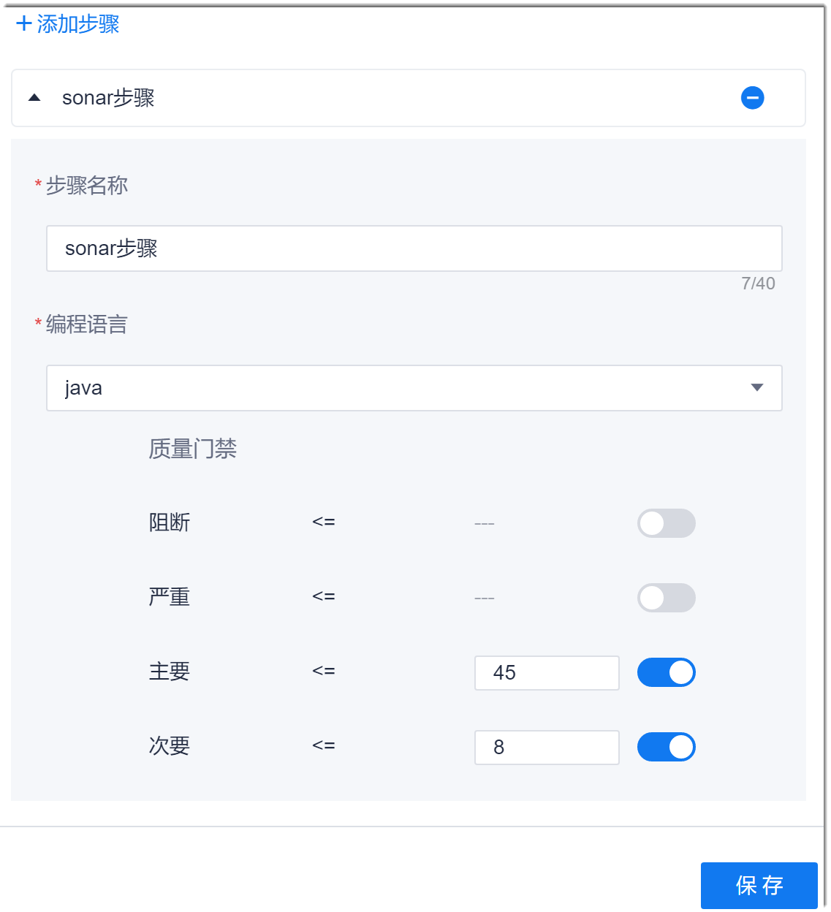

# Sonar检查

“代码检查”服务中的检查任务也是Sonar检查。在配置Sonar检查任务时，您可以关联已有的代码检查任务，也可以新建任务。选择新建任务时，步骤执行后，系统会在“代码检查”中自动新建一个任务。名称为“<流水线名称>_自动生成的代码检查任务”。

### 背景信息
Sonar是一个代码质量管理的平台，支持七个维度的代码静态检查：

|检查维度|说明 |
| :--------- | :-------- |
|代码规范 |通过PMD、CheckStyle、Findbugs等代码规则检测工具检查代码规范。|
|潜在的缺陷|通过PMD、CheckStyle、Findbugs等代码规则检测工具检测出潜在的缺陷。|
|复杂度|检测文件、类、方法等的复杂度。|
|重复|检测重复的代码。|
|注释不足或者过多|没有注释将使代码可读性变差。而过多的注释又会使得开发人员将精力过多地花费在阅读注释上，亦违背初衷。|
|单元测试覆盖率|统计并展示单元测试覆盖率。|
|糟糕的设计 |检测循环、包与包、类与类之间的相互依赖关系，管理第三方的jar包，检测耦合等。|

Sonar支持的语言包括java、C#、C/C++、PL/SQL、Cobol、JavaScrip、Groovy、PHP等。系统的Sonar代码检查当前只支持java、JavaScrip、PHP、C、HTML、CSS语言。

### 操作步骤
1. 在流水线任务编辑界面中，添加“代码检查 > Sonar检查”步骤。
2. 配置Sonar步骤。          
     设置步骤名称、任务类型和编程语言，然后设置质量门禁：            
     将需要判断的问题级别开关置为ON（蓝色），然后设置门禁。含义为：Sonar代码检查出的对应问题级别的问题数小于等于门禁时，Sonar检查通过；否则不通过。设置多个级别的门禁时，需同时满足条件，检查方能通过。          
     

