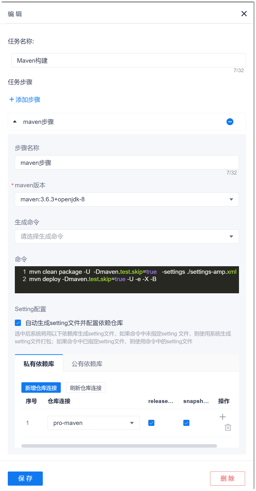

# Maven构建

Maven一般用于后端程序的代码编译构建，也可以使用Maven完成文档、报告的生成，依赖的拉取，文件的上传下载，单元测试等工作。       


### 背景信息
Maven构建采用Maven官方公共依赖库作为默认依赖库。您也可以将依赖仓库配置为系统代码仓库，或者其它私服仓库。Maven制品仓库提供两个版本仓库：Snapshot版本和Release版本。请根据实际情况使用对应的仓库。
* Snapshot版本代表不稳定、尚处于开发中的版本。
* Release版本代表稳定的版本。

在Maven构建前，需要配置setting文件，指定依赖库。在Maven构建命令中需指定setting文件的路径。系统支持自动生成setting文件并配置依赖库。采用自动生成setting文件方式时，无需在命令中指定setting文件路径，使Maven构建的配置更简便。       

如果使用系统依赖库进行本地构建，系统依赖库的信息和配置指导请参见“制品库 > Maven仓库 > Maven配置指南”。 

### 操作步骤       
1. （可选，采用自行配置setting文件且使用非默认依赖库进行构建时执行。）修改setting文件中的依赖库相关信息（例如：仓库地址、认证信息），然后放到代码源的根目录下。         
2. 在流水线任务编辑页面中，添加“构建 > Maven构建”步骤。   
3. 配置Maven构建步骤。                             
  1. 设置步骤名称，选择Maven版本。
  2. 在命令框中，输入命令。    
      如果采用自行配置setting文件且使用非默认依赖库进行构建，则需在命令中指定setting文件的路径。执行命令如下所示：       
```
# 命令
mvn clean package -Pdev -Dmaven.test.skip=true -settings <setting文件在代码库的路径>
# 举例，setting文件名为“setting-amp.xml”
mvn clean package -Pdev -Dmaven.test.skip=true -settings ./setting-amp.xml
```
    如果采用自动生成setting文件的方式，或者使用默认依赖库进行构建，则无需在命令中指定setting文件的路径。            
  3. 选择是否“自动生成setting文件并配置依赖仓库”。        
    如果勾选此选项，表示使用自动生成的setting文件进行Maven构建。如果命令中指定了setting文件，该setting文件无效。如果不勾选此选项，则表示使用命令中指定的setting文件进行构建。       
  4. （可选，勾选“自动生成setting文件并配置依赖仓库”后执行）添加私有依赖库或/和公有依赖库。           
    私有依赖库的取值来源于项目的Nexus repository类授权类接入点（参见[添加授权类接入点](6.7.3.1-add-certificate-ap.md)）。        
    如果同时配置了多个依赖库，拉取依赖的先后顺序如下：公有依赖库的添加时间由近到远、私有依赖库的添加时间由近到远。                  
        
   
### 常用Maven命令       
Maven常用构建命令如下表所示。Maven的使用详见[Maven官方文档](https://maven.apache.org/index.html)。
> [!NOTE]
> Maven在打包前默认执行编译、测试等操作。因此，若无参数指定，打包命令均会执行编译、测试等操作。

|目的|命令or参数|说明|
| :--------- | :-------- | :----- |
|编译|mvn compile|-|
|编译并测试|mvn test|-|
|打包|mvn package|-|
|打包并发布到本地maven仓库|mvn install|-|
|打包并发布到本地和远程maven仓库|mvn deploy|-|
|查看当前项目中的已解析依赖|mvn dependency:list|-|
|查看当前项目的依赖树|mvn dependency:tree|-|
|清理输出目录默认“target/”|mvn clean|-|
|编译，并编译至“target/classes”目录下|mvn clean compline|-|
|打包，并发布到“target/”目录下|mvn clean package|-|
|更新依赖|**-U**参数|作为其它命令的参数执行，例如：**mvn deploy -B -e -U -X**|
|打印完整的stack trace，便于分析问题|**-e**参数|作为其它命令的参数执行，例如：**mvn deploy -B -e -U -X**|
|使用批处理模式构建|**-B**参数|作为其它命令的参数执行，例如：**mvn deploy -B -e -U -X**|
|开启Debug模式|**-X**参数|作为其它命令的参数执行，例如：**mvn deploy -B -e -U -X**|
|不执行测试用例，但编译测试用例类|**-DskipTests**|可以与其它命令组合执行，也可以单独执行，例如：**mvn -DskipTests**|
|不执行测试用例，也不编译测试用例类|**-Dmaven.test.skip=true**|可以与其它命令组合执行，也可以单独执行，例如：**mvn -Dmaven.test.skip=true**|
