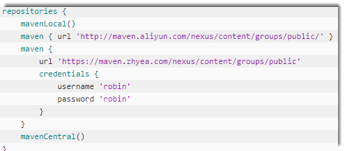
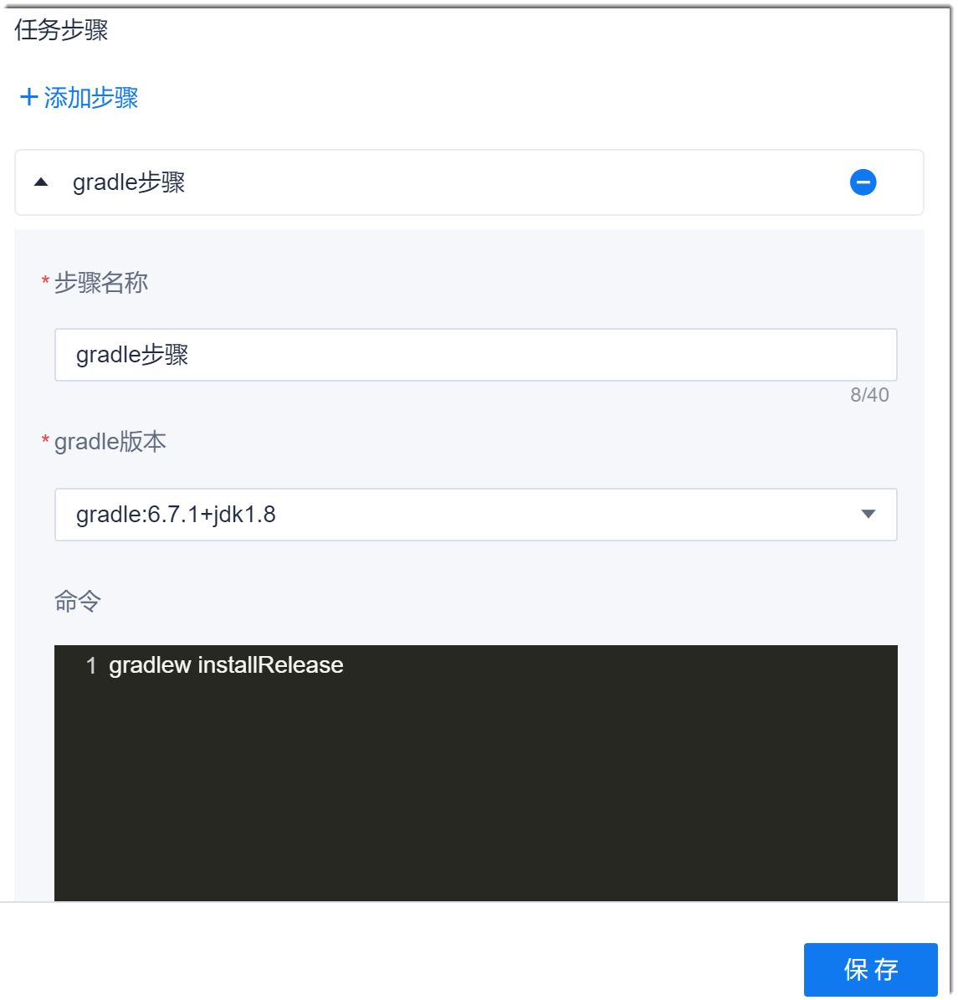

# Gradle构建

Gradle是以Groovy为基础，基于DSL语法的自动化构建工具，其依赖兼容Maven和ivy。Gradle以面向Java应用为主，当前支持的语言包括C++、Java、Groovy、Kotlin、Scala和Swift，后续会扩展。Gradle一般也用于后端程序的代码编译构建。        

### 背景信息
Gradle构建采用Gradle官方依赖库作为默认依赖仓库。您也可以将仓库配置为系统代码仓库，或者其它私服仓库。在本系统中，Gradle构建使用Maven制品仓库。Maven制品仓库提供两个版本仓库：Snapshot版本和Release版本。请根据实际情况使用对应的仓库。
* Snapshot版本代表不稳定、尚处于开发中的版本。
* Release版本代表稳定的版本。

如果使用系统依赖库进行本地构建，请根据“制品库 > Maven仓库 > Gradle配置指南”中的指导配置全局依赖仓库。

### 操作步骤                
1. （可选）配置系统的Gradle依赖仓库。                
  如果您采用系统仓库或者其它私服仓库进行构建，则需要修改“build.gradle”（一般存放在根目录）中配置的依赖库信息，如下图所示。         
                
2. 配置Gradle构建步骤。                            
  在流水线任务中，添加“构建 > Gradle构建”步骤，设置步骤名称，选择gradle版本。并根据实际情况，在命令框中输入对应的命令。然后，单击“保存”。                         
              
3. 配置Gradle命令。                     
    Gradle常用构建命令如下表所示。Gradle的使用请参见[Gradle官方文档](https://docs.gradle.org/current/samples/sample_building_java_libraries.html)。                      
    
|目的|命令or参数|
| :--------- | :-------- |
|查询Gradle版本号|gradlew -v|
|删除HelloWord/app目录下的build文件夹|gradlew clean|
|检查依赖并编译打包|gradlew build|
|编译并打Debug包|gradlew assembleDebug|
|编译并打Release的包|gradlew assembleRelease|
|Release模式打包并安装|gradlew installRelease|
|卸载Release模式包|gradlew uninstallRelease|

