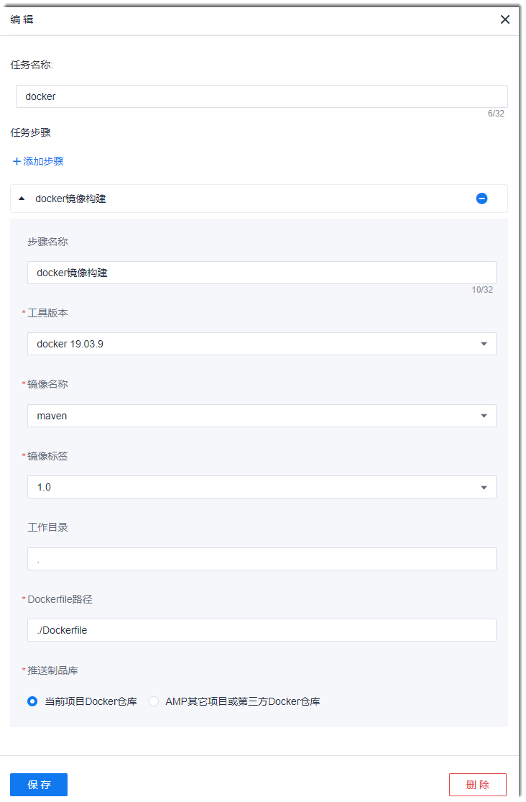

# Docker镜像

系统通过Docker构建组件，提供对各语言的通用镜像构建能力，使您可以通过使用代码库中的Dockerfile构建容器镜像，并推送到容器镜像仓库中。

### 前提条件
* 构建的代码库中已上传Dockerfile文件。Dockerfile的信息请参见[Docker官网](https://www.docker.org.cn/)。
* 已创建Docker仓库的授权类接入点（请参见[管理授权类接入点](6.7.3 管理授权类接入点.html)），或者已获取Docker仓库的仓库地址、用户名密码、仓库项目名称，并且Docker仓库与本系统可互联互通。

### 背景信息
您可以将Docker镜像构建后的制品推送到系统的Docker仓库，也可以推送到第三方Docker仓库。           
本系统的Docker镜像仓库的信息请通过项目的“制品库 > docker镜像”查看。       
您可以将Maven、Gradle、NPM、Conan构建完成的软件包再打包为Docker镜像，也可以直接将代码打包为Docker镜像，用于K8s部署。   

### 操作步骤
1. 在流水线任务中，添加“构建 > Docker镜像构建”步骤。
2. 根据下表的描述，设置Docker镜像构建步骤的参数，单击“保存”。      
             
   <table>
<tr>
    <th>参数</th>
    <th>说明</th>
</tr>
<tr>
    <td>步骤名称 </td>
    <td>自定义步骤的名称。支持最多32个字符。</td>
</tr>
<tr>
    <td>工具版本</td>
    <td>选择构建工具的版本。</td>
</tr>
<tr>
    <td>镜像名称</td>
    <td>可以选择已设置的字符串类型参数，或者单击对话框，直接输入自定义的镜像名称。字符串类型参数的设置请参见<a href="12.6.1 设置流水线参数.html">设置流水线参数</a>。</td>
</tr>
<tr>
    <td>镜像标签</td>
    <td>可以选择已设置的字符串、自增长类型参数，或者单击对话框，直接输入自定义的镜像名称。字符串、自增长类型参数的设置请参见<a href="12.6.1 设置流水线参数.html">设置流水线参数</a>。</td>
    </tr>
  <tr>
    <td>工作目录</td>
    <td>执行<b>docker build</b>的目录。</td>
  </tr>
<tr>
    <td>Dockerfile路径</td>
    <td>Dockefile相对于“工作目录”的路径。</td>
</tr>
<tr>
    <td>推送制品库</td>
    <td><ul><li><b>当前项目Docker仓库</b>：仓库在本项目的“制品库 > docker镜像”中。</li>
    <li><b>AMP其它项目或第三方Docker仓库</b>：可以选择已配置的Docker类<a href="6.7.3 管理授权类接入点.html">授权接入点</a>，或者单击“新增”创建新的Docker仓库。然后设置“仓库项目名称”。</li>
    </td>
</tr>
</table>

