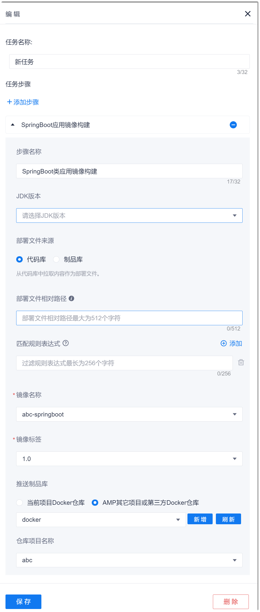

# Spring Boot应用镜像构建

Spring Boot应用镜像构建支持将Java语言和Spring Boot框架开发的应用进行容器镜像构建。在构建时只需指定编译后的文件和构建工具版本即可完成应用的容器镜像构建，而无需编写Dockerfile文件，操作更简便，效率更高。

### 前提条件
* 已创建Docker仓库的授权类接入点（请参见[管理授权类接入点](6.7.3 管理授权类接入点.html)），或者已获取Docker仓库的仓库地址、用户名密码、仓库项目名称，并且Docker仓库与本系统可互联互通。

### 背景信息
您可以将Docker镜像构建后的制品推送到系统的Docker仓库，也可以推送到第三方Docker仓库。           
本系统的Docker镜像仓库的信息请通过项目的“制品库 > docker镜像”查看。         

### 操作步骤
1. 在流水线任务中，添加“构建 > SpringBoot应用镜像构建”步骤。
2. 根据下表的描述，设置SpringBoot应用镜像构建步骤的参数，单击“保存”。      
             
   <table>
<tr>
    <th>参数</th>
    <th>说明</th>
</tr>
<tr>
    <td>步骤名称 </td>
    <td>自定义步骤的名称。支持最多32个字符。</td>
</tr>
<tr>
    <td>JDK版本</td>
    <td>选择构建工具的版本。</td>
</tr>
<tr>
    <td>部署文件来源 </td>
    <td><ul><li>代码库：从执行机的“部署文件相对路径”中获取镜像构建的源文件。</li><li>制品库：从制品库的文件仓库中拉取软件包作为镜像构建的源文件。</li></ul></td>
</tr>
<tr>
    <td>部署文件相对路径</td>
    <td>“部署文件来源”选择“代码库”时，本参数有效。
表示镜像构建源文件相对于文件根目录的相对路径。最多支持128个字符。
</td>
</tr>
<tr>
    <td>过滤规则表达式</td>
    <td>选择镜像构建源文件时，将排除满足表达式条件的文件和文件夹。可通过参数右侧的“添加”按钮，添加多条规则。有多条规则时，取所有规则的并集。
表达式从项目根目录开始匹配：“?”匹配单个字符；“** ”匹配多个文件夹；“* ”匹配多个字符。例如，匹配src目录下的Java文件，则表达式设置为：src/** /*.java。
</td>
</tr>
<tr>
    <td>制品库文件仓库文件版本</td>
    <td>“部署文件来源”选择“制品库”时，本参数有效。
您需要先将文件仓库的文件版本设置为<a href="12.6.1 设置流水线参数.html#添加制品库文件仓库类参数">制品库文件仓库类参数</a>中的“版本号”参数，然后从下拉菜单中选择。</td>
    </tr>
<tr>
    <td>镜像名称</td>
    <td>可以选择已设置的字符串类型参数，或者单击对话框，直接输入自定义的镜像名称。字符串类型参数的设置请参见<a href="12.6.1 设置流水线参数.html">设置流水线参数</a>。</td>
</tr>
<tr>
    <td>镜像标签</td>
    <td>可以选择已设置的字符串、自增长类型参数，或者单击对话框，直接输入自定义的镜像名称。字符串、自增长类型参数的设置请参见<a href="12.6.1 设置流水线参数.html">设置流水线参数</a>。</td>
    </tr>
  <tr>
    <td>推送制品库</td>
    <td><ul><li><b>当前项目Docker仓库</b>：仓库在本项目的“制品库 > docker镜像”中。</li>
    <li><b>AMP其它项目或第三方Docker仓库</b>：可以选择已配置的Docker类<a href="6.7.3 管理授权类接入点.html">授权接入点</a>，或者单击“新增”创建新的Docker仓库。然后设置“仓库项目名称”。</li>
    </td>
</tr>
</table>

