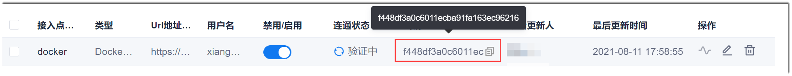
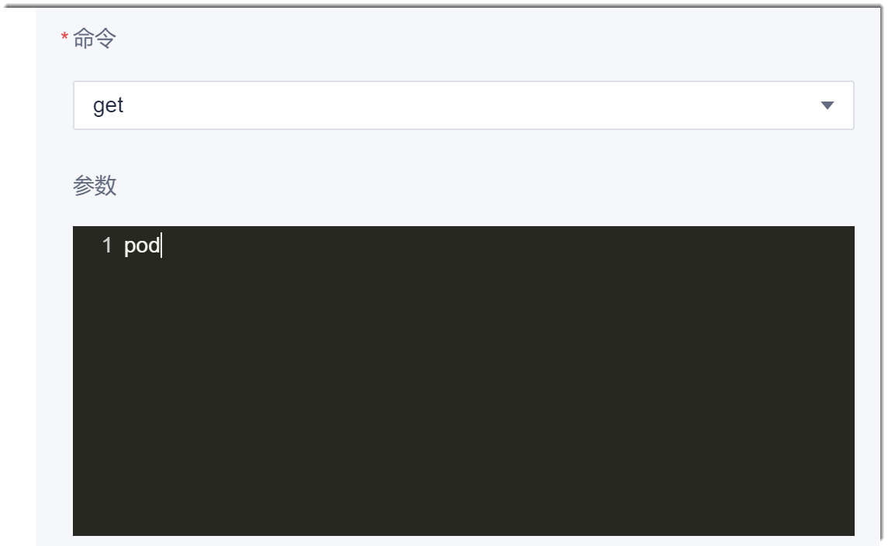
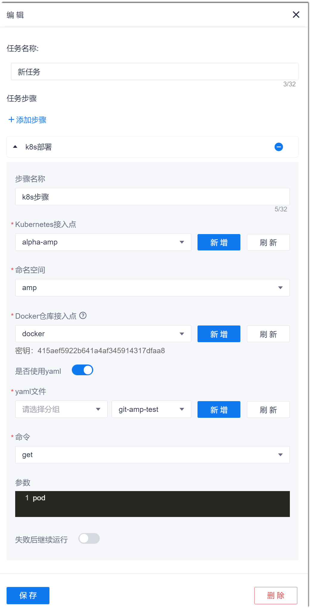

# K8s部署

您可以在流水线中配置K8s步骤，将软件部署到K8s集群中。

### 背景信息
在K8s部署中，您可以选择对应版本的Docker镜像，从而完成对应版本的产品部署。

### 操作步骤
1. 在流水线的任务编辑界面中，添加“部署 > K8s部署”步骤。
2. 配置“K8s部署”步骤。
   1. 设置“步骤名称”。
   2. 在“Kubernetes接入点”下拉框中，选择已配置的K8s接入点（接入点可以项目统一配置，参见[添加K8s接入点](6.7.1.2 添加k8s接入点.html)）。如果没有适用的接入点，单击后面的“新增”，创建接入点。              
   3. 设置“命名空间”，表示将应用部署到K8s的哪个命名空间中。设置为已选择的“Kubernetes接入点”中的命名空间。                
        您可以将命名空间设置为字符串类参数（参见[添加字符串类参数](12.6.1 设置流水线参数.html#添加字符串类参数)），也可以直接输入命名空间。         
   4. 设置“Docker仓库接入点”，表示从哪个Docker仓库中获取镜像。        
   3. （可选）配置yaml文件。                                 
       yaml文件根据k8s的API规则定义k8s的所有资源。请根据实际情况设置“是否使用yaml”。如果使用yaml，需选择yaml文件。其中，yaml文件中需要将密钥替换为“Docker仓库接入点”的Docker仓库密钥。“Docker仓库接入点”的密钥从“项目设置 > 接入点设置 > 授权类接入点”中获取，如下图所示：      
                                 
       yaml文件除了可以单击“新增”，配置当前流水线使用的yaml文件外，也可以项目统一配置，参见[设置通用yaml文件](12.6.7 设置通用yaml文件.html)。                                   
   4. 配置kubectl命令。
    一个K8s步骤只能配置一条kubectl命令。                     
    在“命令”和“参数”中，共同配置kubectl命令：在“命令”中选择命令，在“参数”框中，输入命令后面的参数。                               
    例如，执行**kubectl get pod**命令，则在“命令”中选择“get”，在“参数”框中，输入“pod”。         
    

   5. 设置是否“失败后继续运行”，然后单击“保存”。                           
         失败后继续运行是指当前步骤执行失败后，继续执行后续的步骤。                                    
    

