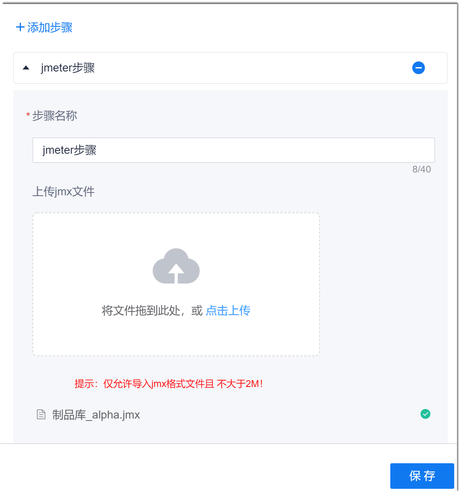

# JMeter测试

JMeter用于对静态和动态的资源（文件、Servlet、Perl脚本、java 对象、数据库和查询等）进行性能测试。JMeter通过对服务器、网络或对象模拟巨大的负载，测试应用强度和分析整体性能。另外，JMeter也能够对应用程序做功能/回归测试。

### 操作步骤                 
1. 在流水线的任务编辑页面中，添加“测试 > Jmeter任务”步骤。
2. 配置JMeter测试步骤。              
     配置“步骤名称”、  上传jmx文件，单击“保存”。           
     一个JMeter步骤中，只能上传一个jmx文件。如果重复上传文件，则后上传的文件将替换先上传的文件。如果上传的文件错误，可以将鼠标放到文件上，单击后面的，删除文件。                               
     

