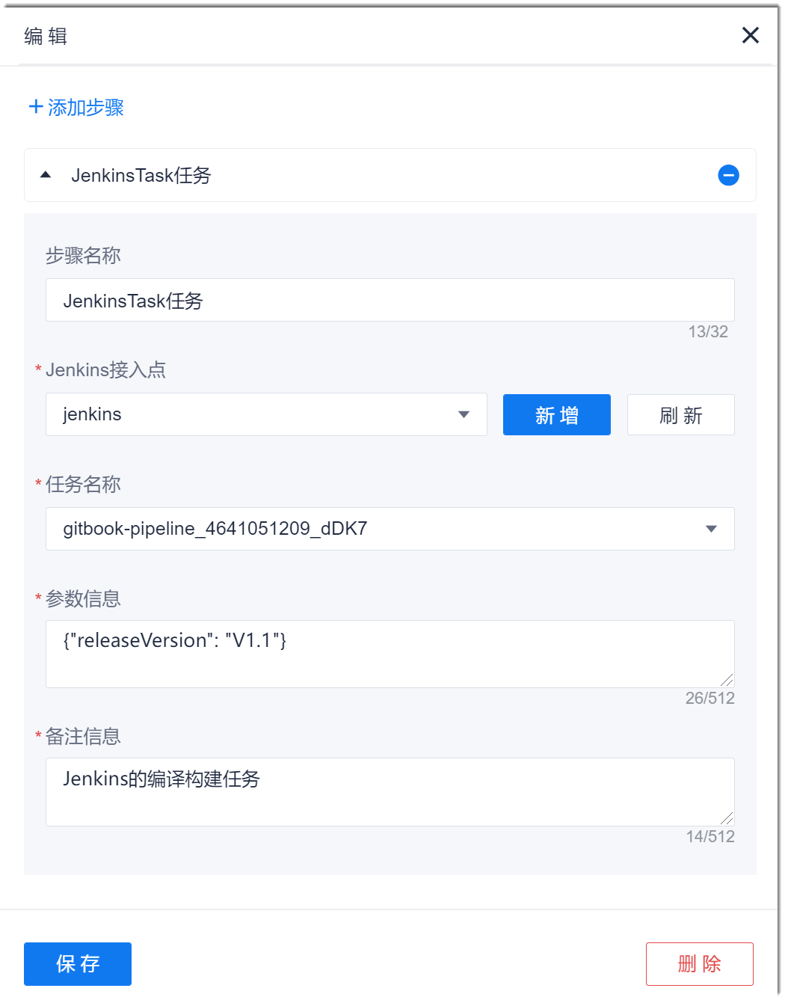

# 配置Jenkins Task步骤

如果Jenkins中已创建需要的任务，您也可以在流水线中直接引用Jenkins中的任务，然后在流水线中执行。   

### 前提条件
* Jenkins中已有需要的任务。
* 已添加[添加Jenkins类授权接入点](6.7.3.1-add-certificate-ap.md)。

### 操作步骤
1. 在流水线的任务编辑页面中，添加“扩展类型 > Jenkins Task任务”步骤。
2. 根据下表的描述，配置Jenkins Task步骤，单击“保存”。                                   
           
    <table>
<tr>
    <th>参数</th>
    <th>说明</th>
</tr>
<tr>
    <td>步骤名称 </td>
    <td>自定义步骤的名称。支持最多32个字符。</td>
</tr>
<tr>
    <td>Jenkins接入点 </td>
    <td>下拉菜单中的取值来源于在本项目中配置的<a href="6.7.3.1-add-certificate-ap.md">Jenkins类授权接入点</a>。如果已有的授权接入点不满足要求，您可以单击“新增”，新建一个Jenkins类授权接入点。新建的接入点也会统一纳入项目接入点中统一管理。</td>
</tr>
<tr>
    <td>任务名称</td>
    <td>与Jenkins中的任务名称一致。您可以将任务名称配置为字符串类参数，然后在流水线中引用，也可以直接在流水线中输入。</td>
</tr>
<tr>
    <td>参数信息</td>
    <td>指定Jenkins任务中的参数取值。参数名称需与Jenkins中任务的参数一致。格式：{"<i>Jenkins任务的参数名称</i>": "<i>参数取值</i>”}。多个参数之间以英文逗号分隔。例如：{“releaseVersion": "1.0","appName": "abc"'}。</td>
</tr>
<tr>
    <td>备注信息</td>
    <td>对Jenkins Task步骤的描述信息，不超过512个字符。</td>
    </tr>
</table>

