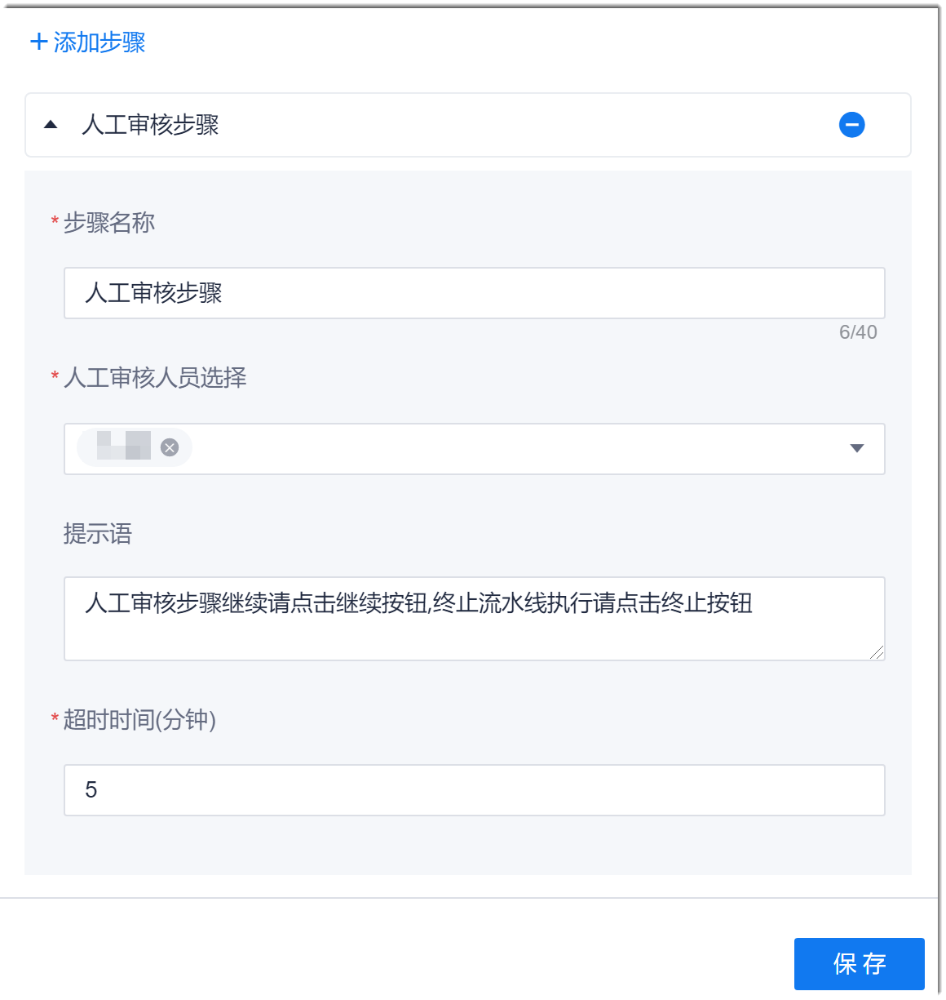

# 配置人工审核步骤

当流水线中需要人工审核时，您可以配置人工审核步骤。

### 背景信息             
如果个人消息通知中勾选了“流水线”，当流水线执行到人工审核步骤时，系统会通过系统消息通知审核人。如果[流水线的通知策略](12.6.5-set-note-policy-for-pipeline.md)也将“流水线需要审批”的邮件开关置为ON，当流水线执行到人工审核步骤时，系统还会给审核人发送邮件审核通知。

### 操作步骤            
1. 在流水线的任务编辑页面中，添加“流水线控制 > 人工审核”步骤。
2. 配置“人工审核”步骤。                        
     输入步骤名称，选择审核人，设置步骤提示语和“超时时间”，然后单击“保存”。                     
     “超时时间”表示超过时间后，如果还没有审核，则流水线会被终止。                        
     
