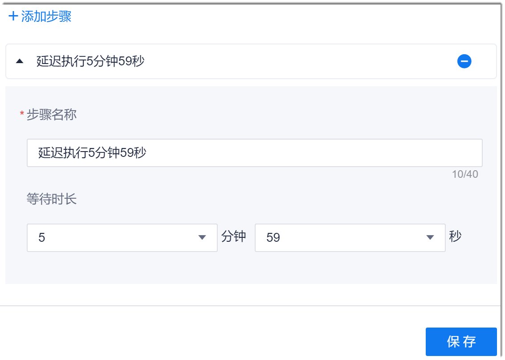

# 配置延迟执行步骤

当下一个步骤需要等待一定时间后再执行时，您可以添加“延迟执行”步骤。最多可等待15分钟59秒。

### 操作步骤
1. 在流水线的任务编辑页面中，添加“流水线控制 > 延迟执行”步骤。
2. 配置“延迟执行”步骤。                       
     输入步骤名称，设置“等待时长”，然后单击“保存”。                       
     
