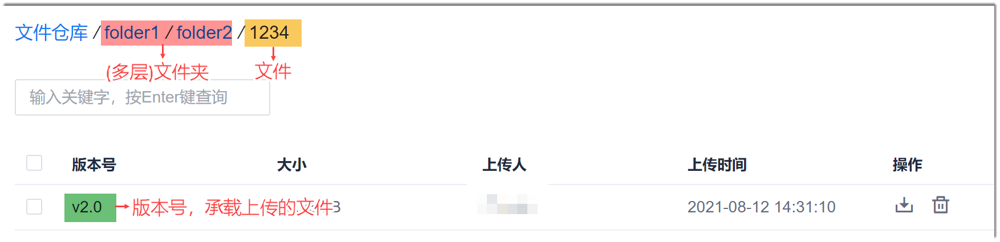
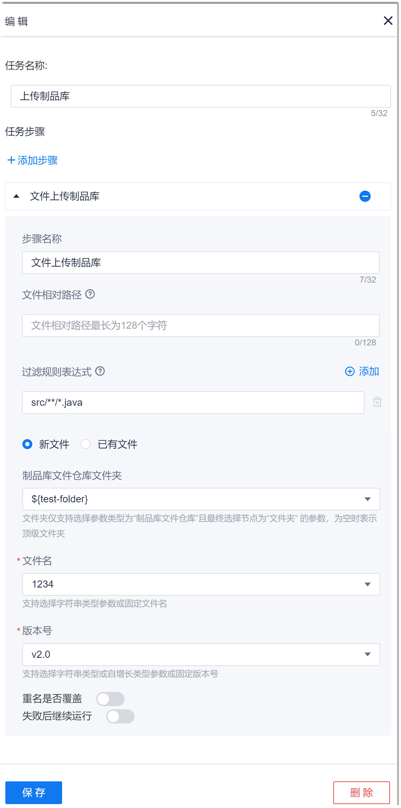

# 配置“文件上传制品库”步骤

为了支持主机部署的版本回退，您可以将代码文件打包上传到制品库的文件仓库中。当需要部署历史版本的软件时，在[主机部署](12.3.3.2-deploy-on-hosts.md)时选择从制品库的文件仓库中的相应版本进行部署。

### 背景信息
上传的文件可以是代码库的原始文件，也可以是编译构建后的文件，具体文件通过“文件相对路径”参数指定。    
  流水线执行时，会将代码源中的代码缓存在执行机的某个路径（假设为A目录）下，并且编译构建后的文档及其相对路径也会存放在执行的A目录下。A目录即为文件根目录。      

“制品库 > 文件仓库”的目录结构如下图所示。     

### 操作步骤
1. 在流水线的任务编辑页面中，添加“上传 > 文件上传制品库”步骤。
2. 配置“文件上传制品库”步骤。                                
    根据下表描述，配置“文件上传制品库”步骤的相关参数，单击“保存”。        
  
    <table>
<tr>
    <th>参数</th>
    <th>说明</th>
</tr>
<tr>
    <td>步骤名称 </td>
    <td>自定义步骤的名称。支持最多32个字符。</td>
</tr>
<tr>
    <td>文件相对路径 </td>
    <td>表示上传文件相对于文件根目录的相对路径。最多支持128个字符。</td>
</tr>
<tr>
    <td>过滤规则表达式</td>
    <td>打包上传时，将排除满足表达式条件的文件和文件夹。可通过参数右侧的“添加”按钮，添加多条规则。有多条规则时，取所有规则的并集。
表达式从项目根目录开始匹配：“?”匹配单个字符；“** ”匹配多个文件夹；“* ”匹配多个字符。例如，匹配src目录下的Java文件，则表达式设置为：src/** /*.java。
</td>
</tr>
<tr>
    <td><i>文件类型</i></td>
    <td><ul><li>新文件：  表示将文件上传到新文件中。</li><li>已有文件：表示将文件上传到已有文件中。</td>
</tr>
<tr>
    <td>制品库文件仓库文件夹 </td>
    <td>选择“新文件”时，本参数有效。从下拉菜单中选择上传到文件仓库的哪个文件夹中。下拉菜单取值来源于<a href="12.6.1-set-parms.md#添加制品库文件仓库类参数">制品库文件仓库类参数</a>中的“文件夹类”参数。</td>
</tr>
<tr>
    <td>文件名 </td>
    <td>选择“新文件”时，本参数有效。表示上传到文件仓库的哪个文件中。您可以直接输入文件名，或者从下拉菜单中选择已配置的文件参数。下拉菜单取值来源于<a href="12.6.1-set-parms.md#添加制品库文件仓库类参数">制品库文件仓库类参数</a>中的“文件”类参数。</td>
</tr>
<tr>
    <td>制品库文件仓库文件</td>
    <td>选择“已有文件”时，本参数有效。从下拉菜单中选择上传到文件仓库的哪个文件中。下拉菜单取值来源于<a href="12.6.1-set-parms.md#添加制品库文件仓库类参数">制品库文件仓库类参数</a>中的“文件”类参数。</td>
</tr>
<tr>
    <td>版本号</td>
    <td>表示上传时的文件版本号。您可以直接输入版本号，或者从下拉菜单中选择已配置的<a href="12.6.1-set-parms.md#添加字符串类参数">“字符串类”</a>参数或<a href="12.6.1-set-parms.md#添加自增长类参数">“自增长类”</a>参数。</td>
</tr>
<tr>
    <td>重名是否覆盖</td>
    <td>当文件上传时选择的文件夹、文件和版本号均相同时，代表文件重名。如果本参数置为ON，表示重名时覆盖原文件；置为OFF，表示重名时不覆盖原文件，而是在版本号后面加上时间后缀。</td>
</tr>
<tr>
    <td>失败后继续运行</td>
    <td>表示当前步骤执行失败后，继续执行后续的步骤。</td>
</tr>
</table>
     
  