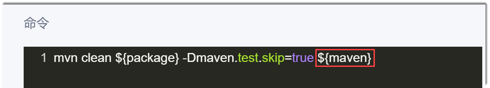
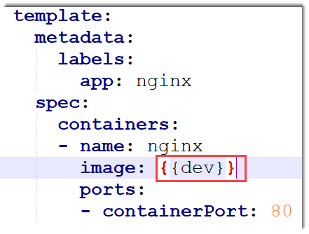
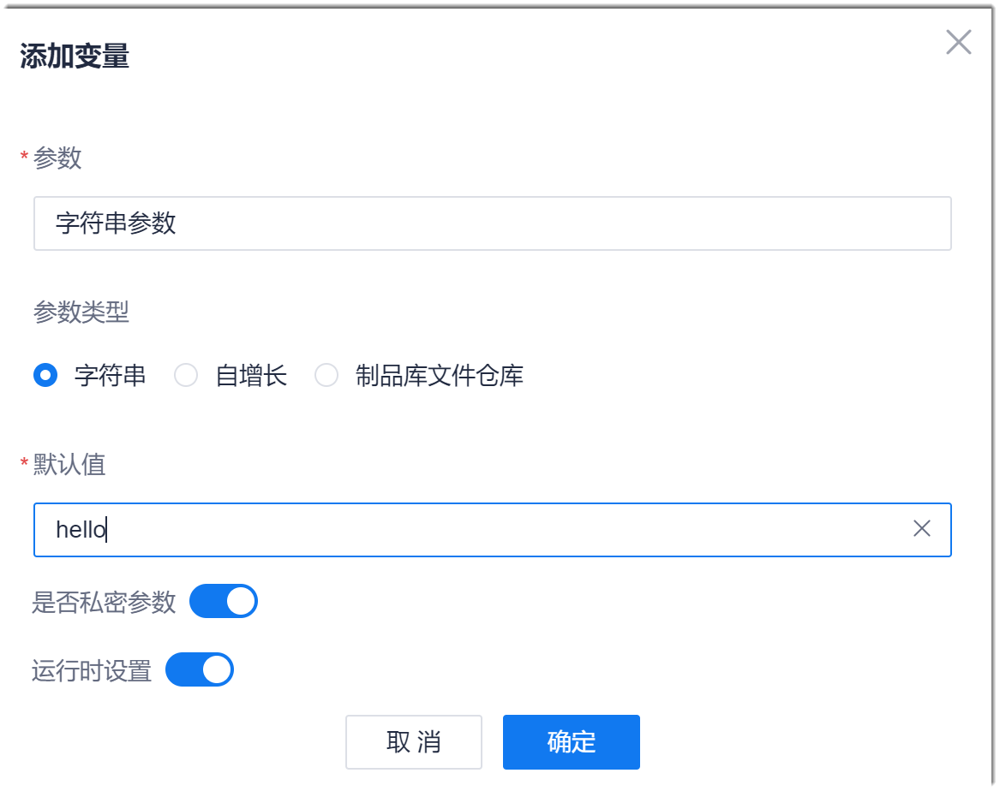
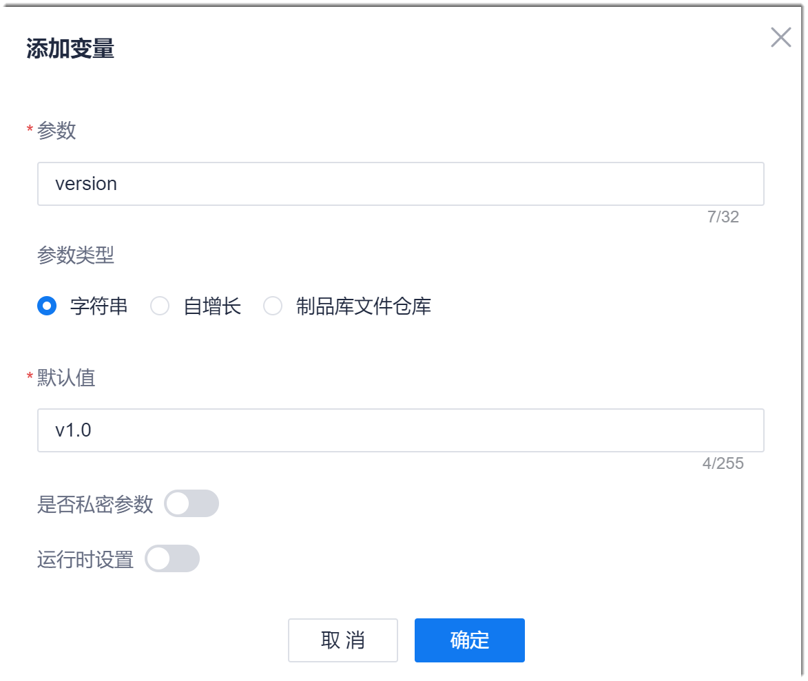
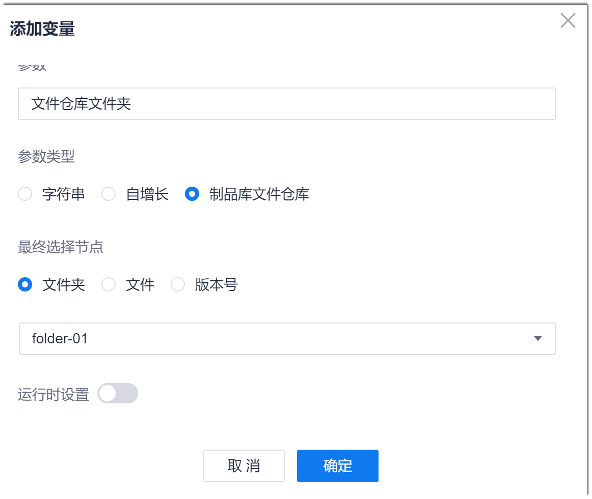

# 设置流水线参数

通过将流水线参数传递给各个步骤使用，实现了步骤间数据流动的统一。用户只需要设置好流水线参数，即可完成构建、部署、测试等任务的数据拉通。

### 前提条件
* 已使用具有流水线“流水线编排”权限，且已成为流水线成员的账号登录系统。
* 已创建流水线。

### 参数的引用方式
* **字符串&自增长类参数**       
  自增长类参数表示每使用一次本参数，参数取值增加一个步长。       
  字符串参数可以在流水线的步骤命令、K8s步骤的yaml文件、“文件上传制品库”、以及“Docker镜像构建”步骤中引用。引用格式如下：    
  * 流水线的步骤命令、“文件上传制品库”、“Docker镜像构建”步骤：${_参数名称_}            
      例如，设置一个名为“maven”的参数，在maven步骤的命令用引用该参数：          
                    
  * yaml文件：{{_参数名称_}}            
      例如，设置一个名为“dev”的参数，在K8s步骤的yaml文件中引用该参数：           
             
 
* **制品库文件仓库类参数**        
  制品库文件仓库类参数将文件仓库中的文件夹、文件和版本号映射为参数，然后在“文件上传制品库”和“主机部署”步骤中引用，引用格式为：${_参数名称_}。
    
### 操作步骤

#### 操作入口
1. 在项目流水线列表界面中，单击操作列的。
2. 在流水线编辑界面中，单击“参数”页签。
3. 在界面右上角，单击“添加变量”。

#### 添加字符串类参数                        
在“添加变量”对话框中，设置参数名称，选择“参数类型”为“字符串”，然后设置“默认值”，并设置“是否私密参数”和是否需要运行时设置，单击“确定”。            
“是否私密参数”表示参数的“默认值”在列表中显示为密文，且在编辑时不显示。         
“运行时设置”表示无论是否有步骤引用该参数，在执行流水线时，均需指定参数取值。              

### 添加自增长类参数          
在“添加变量”对话框中，设置参数名称，选择“参数类型”为“自增长”，然后根据下表的描述，填写其它参数，单击“确定”。            
例如，下图中设置的自增长参数的第一次取值为“V1.0”，第二次取值为“V2.0”，以此类推。            
          
<table>
<tr>
    <th>参数</th>
    <th>说明</th>
</tr>
<tr>
    <td>起始值 </td>
    <td>表示参数第一次被使用时的取值。只能设置为整数。</td>
</tr>
<tr>
    <td>步长</td>
    <td>表示每使用一次，取值增长的步长。只能设置为整数。</td>
</tr>
<tr>
    <td>参数前缀</td>
    <td>表示增长值前面的内容。</td>
</tr>
<tr>
    <td>参数后缀</td>
    <td>表示增长值后面的内容。</td>
</tr>
<tr>
    <td>运行时设置</td>
    <td>表示无论是否有步骤引用该参数，在执行流水线时，均需指定参数取值。 </td>
</tr>
</table>

#### 添加制品库文件仓库类参数          
制品库文件仓库类参数的作用是将文件仓库中的文件夹、文件、版本与流水线的参数做映射，便于流水线的相应步骤引用文件仓库的文件夹、文件和版本。

在“添加变量”对话框中，设置参数名称，选择“参数类型”为“制品库文件仓库”，然后：
* 选择需要映射的文件仓库的文件夹、文件或版本。
* 选择对应文件仓库中的内容。
* 设置是否需要运行时设置。                   
   “运行时设置”表示无论是否有步骤引用该参数，在执行流水线时，均需指定参数取值。         
* 单击“确定”。               

如果您需要修改或删除普通参数，则在参数列表中，单击后面的或。如果参数被引用，删除参数后，流水线将执行失败，请谨慎操作。

