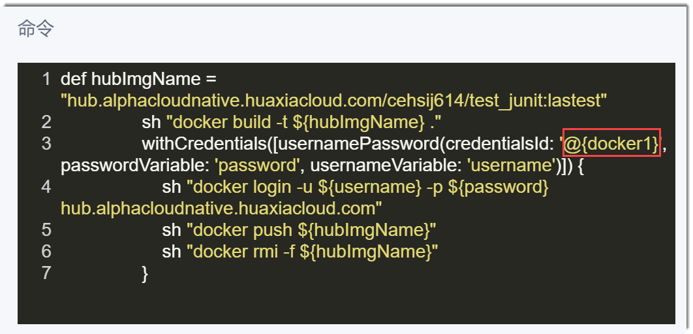
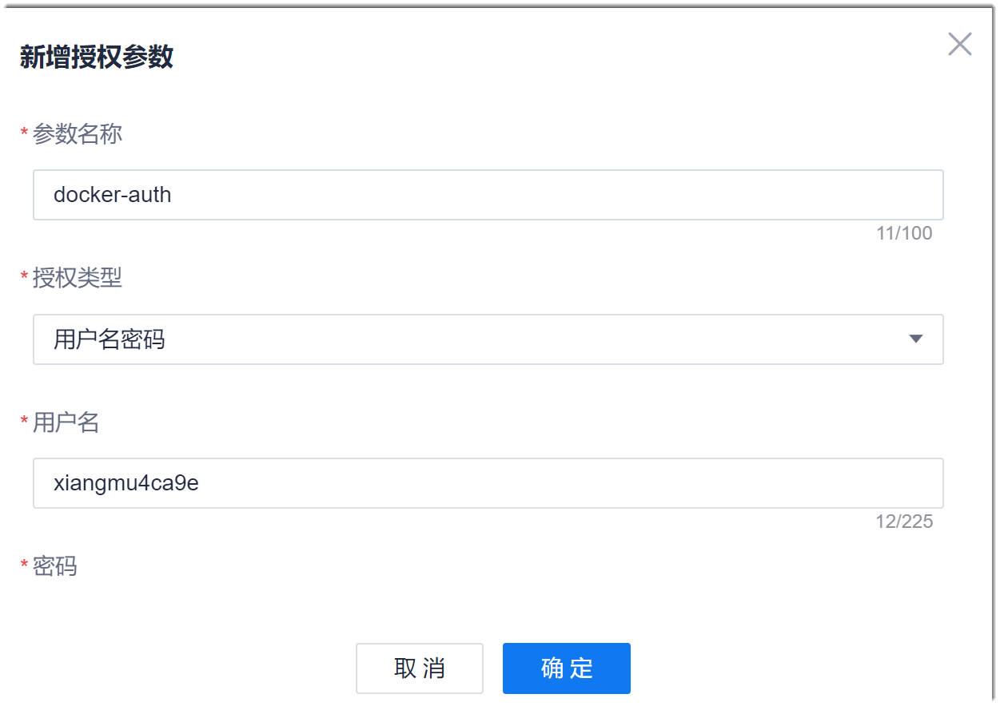

# 设置授权参数

授权参数顾名思义是授权类的参数，例如用户名密码。Cloud Native流水线支持用户名密码和Secret text两种类型的授权参数。

### 前提条件
* 登录系统的账号已成为流水线成员或者为项目负责人、管理员。
* 已创建流水线。

### 背景信息               
您可以设置当前流水线使用的授权参数，也可以设置项目通用的授权参数。            
通用授权参数会显示在项目内每个流水线的“授权参数”列表中，但不能通过流水线的“授权参数”界面进行修改和删除，必须通过通用授权参数界面进行修改和删除。

### 授权参数的引用方式
授权参数可以在流水线的命令中引用，便于安全传递授权信息。授权参数在流水线命令中的引用方式如下：         
@{_授权参数名称_}

例如，设置一个名为“docker1”的授权参数，在docker步骤的命令中引用：         

### 设置当前流水线的授权参数                
1. 在项目流水线列表页面中，单击操作列的。
2. 在流水线编辑页面中，单击“授权参数”页签。 
3. 在授权参数列表页面的右上角，单击“新建参数”。
4. 在“新建授权参数”对话框中，设置参数名称、授权类型，并根据授权类型设置对应的参数，单击“确定”。                        
     

如果您需要修改或删除授权参数，则在参数列表中，单击后面的或。如果参数被引用，删除参数后，流水线将执行失败，请谨慎操作。

### 设置通用授权参数
1. 在流水线列表页面中，单击右上角的“其他设置 > 通用授权参数”。
2. 在授权参数列表页面的右上角，单击“新建参数”。
3. 在“新建授权参数”对话框中，设置参数名称、授权类型，并根据授权类型设置对应的参数，单击“确定”。         
     

通用授权参数创建成功后，您可以在每个流水线任务的“授权参数”中查看到该通用授权参数。                
如果您需要修改或删除授权参数，则在参数列表中，单击后面的或。如果参数被引用，删除参数后，流水线将执行失败，请谨慎操作。

