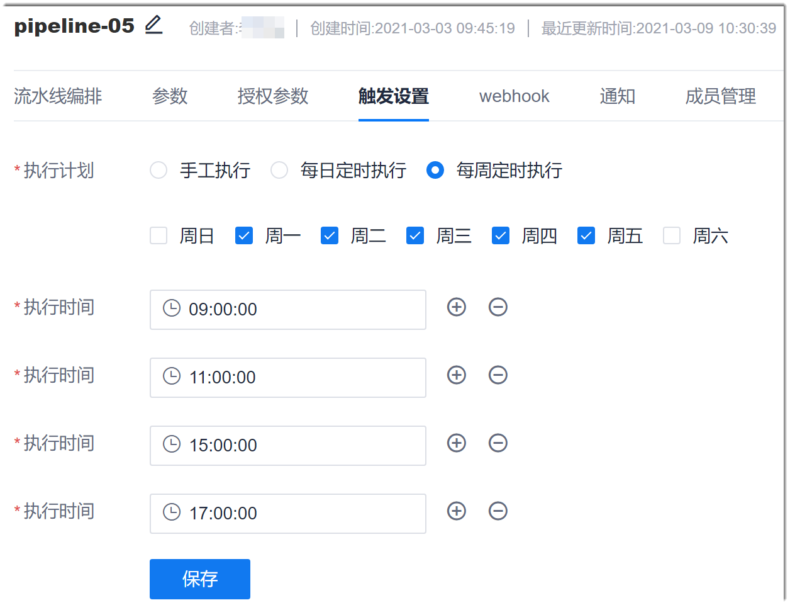

# 设置执行计划

您可以配置流水线定时执行。通过配置流水线定时执行，可以让流水线定时定点自动执行。
### 前提条件
* 已使用具有流水线“触发设置”权限，且已成为流水线成员的账号登录系统。
* 已创建流水线。

### 操作步骤
1. 在项目流水线列表中，单击操作列的，进入流水线编辑界面。
2. 单击“触发设置”页签。
3. 在“执行计划”中，单击“每日定时执行”或“每周定时执行”，然后设置执行时间，单击“保存”。                          
     执行时间可以设置多个。                       
     

配置定时执行周期后，系统会根据配置的定时时间自动执行流水线。