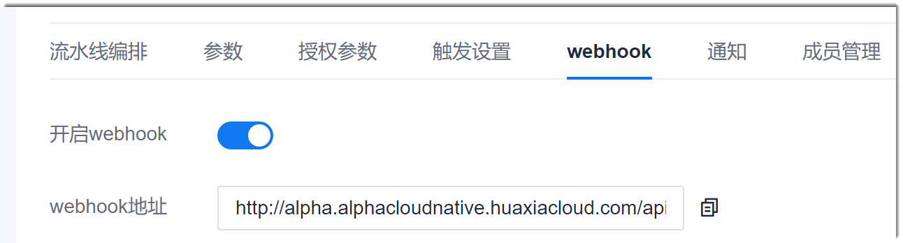

# 设置webhook

系统流水线提供Webhook接口，您可以通过此接口执行想要的操作。

### 前提条件
* 已使用具有流水线“webhook”权限，且已成为流水线成员的账号登录系统。
* 已创建流水线。

### 操作步骤
1. 在项目流水线列表中，单击操作列的，进入流水线编辑界面。
2. 单击“webhook”页签。
3. 开启Webhook。           
     在界面中，将“开启webhook”置为ON，然后您可以单击“webhook地址”后面的，复制webhook地址。                  
     

开启Webhook后，您可以调用此接口执行想要的操作。