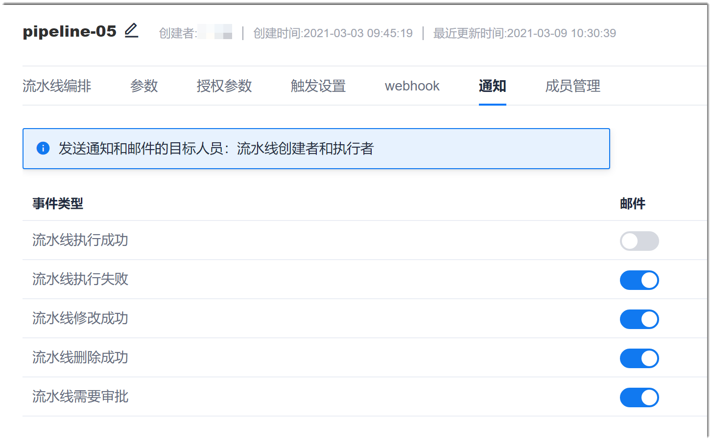

# 设置流水线通知策略

您可以设置流水线相关事件发生后，通过邮件和系统消息的方式发送通知给流水线创建者和执行者。

### 前提条件
* 已使用具有流水线“通知管理”权限，且已成为流水线成员的账号登录系统。
* 已创建流水线。

### 背景信息

流水线的通知成功发送到流水线创建者和执行者，需满足一个前提条件：已勾选个人消息设置中的“流水线”。                  
满足前提条件后，当相应的事件发生时，系统默认发送系统通知给流水线创建者和执行者。当流水线“通知”中，将事件对应的“邮件”置为ON（蓝色）时，系统才会发送邮件通知给相关人员。

### 操作步骤
1. 在项目流水线列表中，单击操作列的，进入流水线编辑界面。
2. 单击“通知”页签。
3. 将需要发送邮件通知的事件置为ON。                        
      

