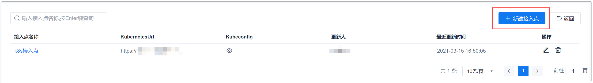
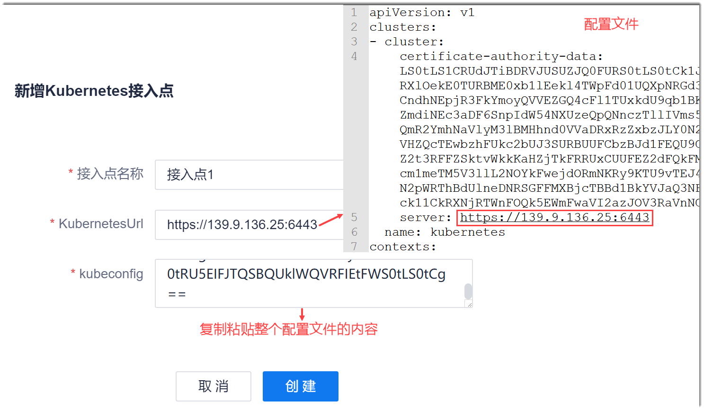
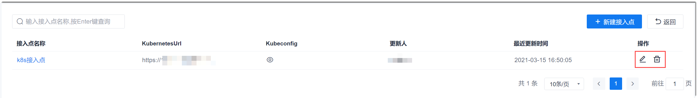

# 设置通用K8s接入点

K8s接入点在配置流水线的“K8s”步骤时使用。您可以只设置当前流水线使用的K8s接入点（参见[K8s部署](12.3.3.1-k8s.md)），也可以设置项目通用的K8s接入点，供项目中的所有流水线的K8s步骤使用，提升配置效率。

### 前提条件
* 登录系统的账号已成为流水线成员。

### 新建接入点       
1. 在流水线列表界面中，单击右上角的“其他设置 > 接入点管理”。                       
    进入通用接入点管理界面。                      
    
2. 在通用接入点管理界面中，单击右上角的“新建接入点”。
3. 在弹出的“新增Kubernetes接入点”对话框中，输入接入点名称，配置KubernetesURL和kubeconfig参数，单击“创建”。               
    K8s接入点信息存放在k8s master节点的“etc/kubernetes/_XXX_.conf”文件中。需配置的接入点信息与配置文件的对应关系如下图所示。                   
    

### 修改/删除接入点                              
在通用接入点管理界面中，单击接入点后面的或，可修改或删除接入点。                    

### 查看接入点的config信息                          
在通用接入点管理界面中，单击“kubeconfig”列的，可查看该接入点的config信息。
