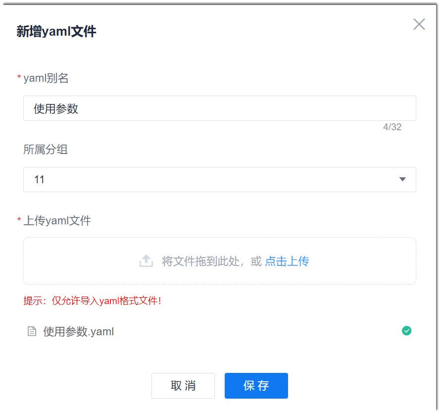
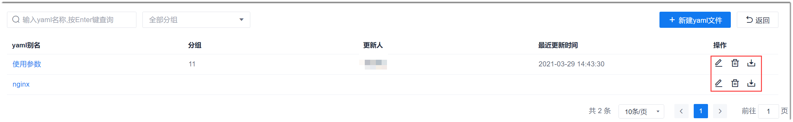

# 设置通用yaml文件

 yaml文件根据k8s的API规则定义k8s的所有资源。如果需要使用yaml，您可以只上传当前流水线使用的yaml（参见[K8s部署](12.3.3.1 K8s部署.html)），也可以上传项目通用的yaml文件，供项目中的所有流水线的K8s步骤使用，提升配置效率。             
其中，上传的yaml文件请根据实际情况编写。
 
### 前提条件        
* 已使用具有项目“流水线 > Yaml文件设置”权限的账号登录系统。
* 登录系统的账号已成为流水线成员。

### 上传yaml文件                  
1. 在流水线列表界面中，单击右上角的“其他设置 > yaml文件管理”。           
    进入通用yaml文件管理界面。                             
                        
2. 在通用yaml文件管理界面中，单击右上角的“新建yaml文件”。
3. 在弹出的“新增yaml文件”对话框中，输入文件别名，配置所属分组，并上传yaml文件，单击“保存”。                    
                  
  
### 修改/删除/下载yaml文件
在通用yaml文件管理界面中，单击文件后面的、或，可修改、删除、下载yaml文件。         

