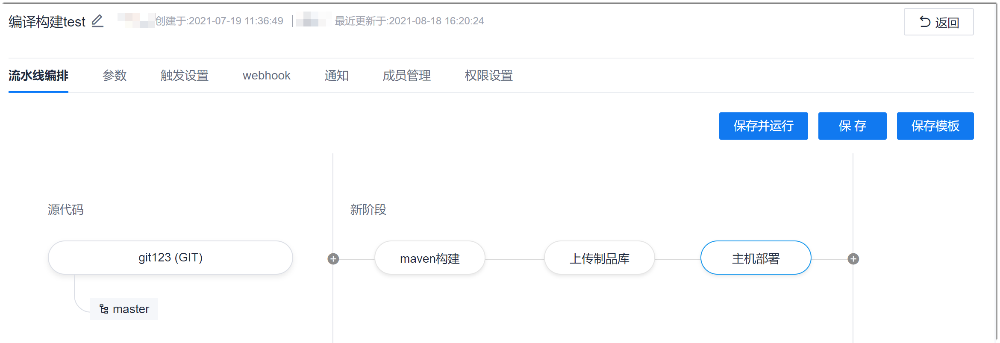

# 修改/删除流水线

描述如何修改和删除流水线。

### 前提条件
* 已使用具有项目流水线相关权限，且已成为流水线成员的账号登录系统。例如，删除流水线需具有流水线“流水线删除”权限；修改流水线需具有流水线“流水线编排”权限。
* 已创建流水线。

### 修改流水线
您可以通过修改流水线，重新编排流水线、设置参数、修改执行计划、设置是否开启webhook、修改通知策略和管理成员。
1. 在项目流水线列表中，单击操作列的；或者单击流水线名称，在流水线执行结果界面单击“编辑”，进入流水线编辑界面。
2. 在流水线编辑界面中，修改相关内容，修改完成后单击“保存”或“保存并运行”。                  
      

### 删除流水线           
当流水线不再使用时，您可以删除流水线，释放资源。
1. 在项目流水线列表中，单击操作列的。
2. 在弹出的确认对话框中，单击“确定”。
