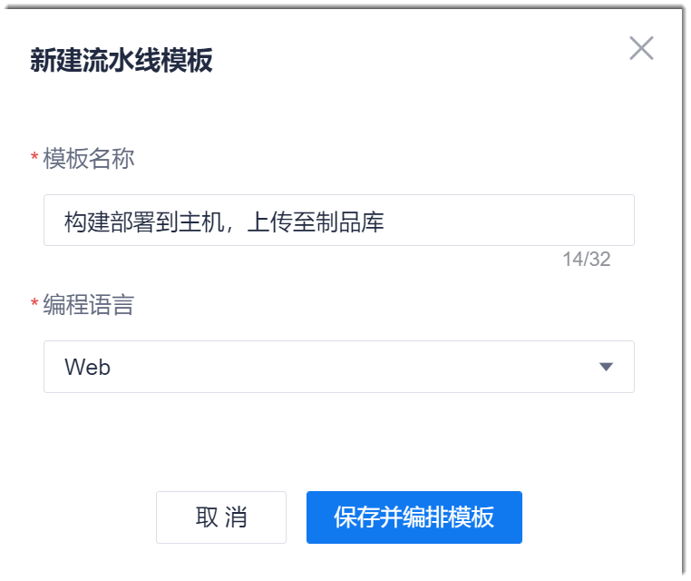
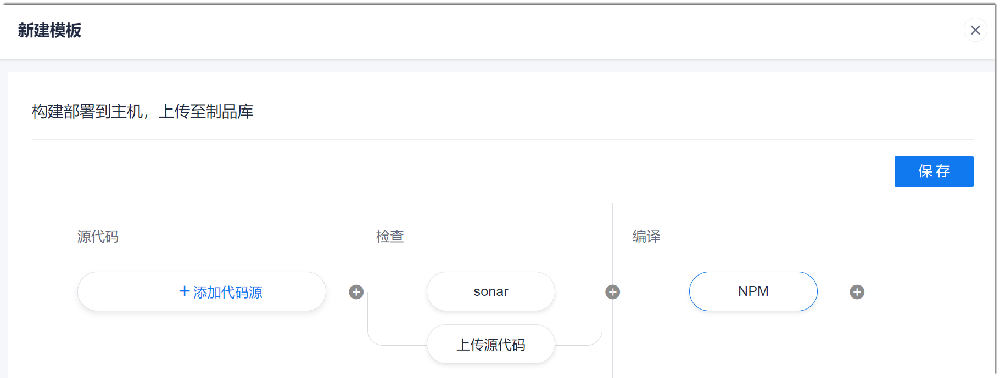
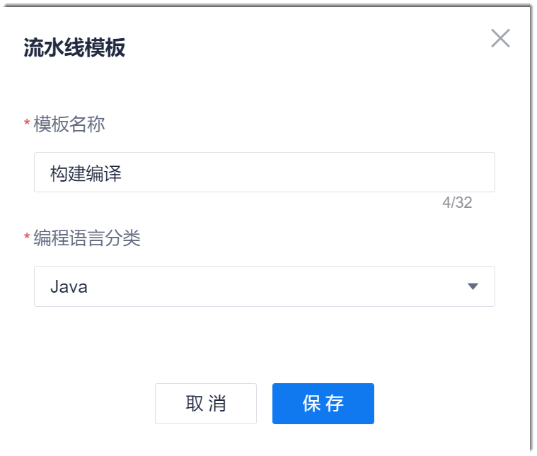

# 创建流水线模板      
 
您可以将已经创建的流水线保存为模板，便于后续流水线引用，提升流水线创建效率。

### 前提条件
* 已使用具有流水线“流水线编排”权限，且已成为流水线成员的账号登录系统。

### 新建流水线模板
1. 在流水线列表页面的右上角，单击“其他设置 > 模板管理”。
2. 在模板管理页面右上角，单击“新建流水线模板”。
3. 在“流水线模板”对话框中，设置模板名称和模板使用的语言，单击“保存并编排模板”。       
                
4. 在流水线编排页面中，参考[创建流水线](12.2-create-pipeline.md)，编排流水线的阶段、任务和步骤。      
  在流水线模板中，您无需且不能设置步骤的详细信息。详细信息在具体流水线中设置。           
              

流水线创建成功后，您可以在流水线模板页面中查看、编辑、删除；也可以在创建流水线时，选择此模板。

### 将流水线保存为模板
1. 在项目流水线列表中，单击操作列的，进入流水线编辑页面。
2. 按照模板的要求编排好流水线后，单击右上角的“保存模板”，将当前流水线另存为模板。                
3. 在“流水线模板”对话框中，设置模板名称和模板使用的语言，单击“确定”。    
    

流水线创建成功后，您可以在流水线列表页面右上角的“其他设置 > 模板管理”中查看、编辑、删除；也可以在创建流水线时，选择此模板。

