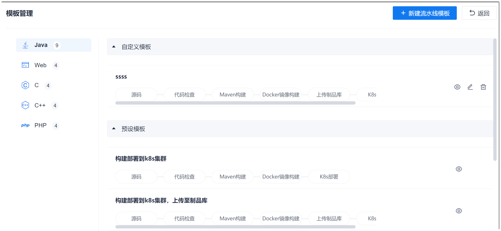

# 查看/修改/删除流水线模板

您可以查看系统预置的流水线和自定义的流水线，了解流水线的信息，便于后续使用。        
您也可以根据实际情况修改或删除自定义的流水线模板，确保数据的整洁。流水线模板被修改和删除后，不会影响使用该模板创建的流水线。   

### 前提条件
* 已使用具有项目“流水线 > 流水线模版查看”或“流水线 > 流水线模版管理”权限的账号登录系统。

### 查看流水线模板
1. 在流水线列表页面中，单击右上角的“其他设置 > 模板管理”。       
  系统按编码语言分类展示流水线模板。
         
2. 在左侧选择编码语言，然后在右侧单击流水线后面的。       
  界面显示流水线的详细信息。

### 修改流水线模板      
只能修改自定义的流水线模板，系统预置的流水线模板不能被修改。      
1. 在流水线列表界面中，单击右上角的“其他设置 > 模板管理”。      
  系统按编码语言分类展示流水线模板。
2. 在左侧选择编码语言，然后在右侧单击流水线后面的。  
3. 在模板编辑界面中，编排流水线，单击“保存”。

### 删除流水线模板      
只能删除自定义的流水线模板，系统预置的流水线模板不能被删除。      
1. 在流水线列表界面中，单击右上角的“其他设置 > 模板管理”。      
  系统按编码语言分类展示流水线模板。
2. 在左侧选择编码语言，然后在右侧单击流水线后面的。  
3. 在弹出的确认对话框中，单击“确定”。
  
