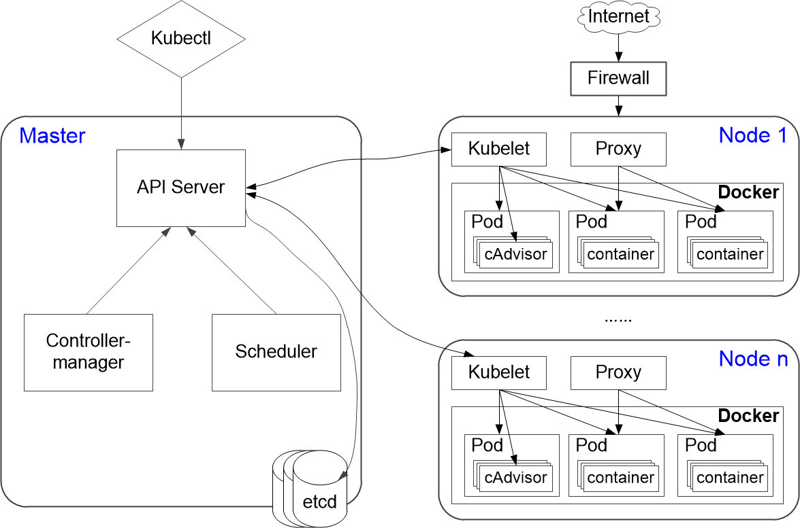

# K8s概述

K8s是kubernetes的缩写。K8s用于管理云平台中多个主机上的容器化应用，为容器化应用的部署、规划、更新、维护提供了一种更简单高效的机制。

### 应用部署的历史阶段
应用的部署经历了以下几个阶段：
* **传统部署**                
    传统的应用部署通过插件或脚本将应用部署在物理服务器上。因此，应用的运行、配置、管理、生命周期等将与当前服务器绑定，不利于应用的升级、更新、回滚等，同时也存在应用间资源分配不合理的问题。
* **虚拟化部署**                        
    虚拟化技术允许在单个物理服务器的CPU上运行多个虚拟机（virtual machine，VM），同时，VM之间支持隔离。虚拟化技术能够更好地利用物理服务器上的资源，实现了可伸缩性，降低了硬件成本。但是VM非常重，不利于可移植性。
* **容器化部署**                    
   容器化部署的每个应用被打包成一个容器镜像，每个应用与容器间成一对一关系。每个容器之间互相隔离，每个容器有自己的文件系统 ，容器之间进程不会相互影响，能区分计算资源。相对于虚拟机，容器能快速部署。同时，由于容器与基础设施、机器文件系统解耦，所以它能在不同云、不同版本操作系统间进行迁移。

### K8s的特点
容器是打包和运行应用程序的方式。K8s提供了一个可弹性运行容器化应用的框架，满足应用的扩展要求、故障转移、部署模式等。K8s具备如下特点：
* 可移植：支持公有云、私有云、混合云、多重云
* 可扩展：模块化、插件化、可挂载、可组合
* 自动化：自动部署、自动重启、自动复制、自动伸缩/扩展

### K8s的架构
K8s集群由Master节点和多个Node（Worker）节点组成，其架构如下图所示。
                                
其中：
* **kubectl**                     
    K8s集群的命令行接口。
* **Master节点**                          
     Master节点是集群控制节点，管理、调度和控制整个集群。Master节点主要由以下模块组成：
  * API server：提供了资源操作的唯一入口，并提供认证、授权、访问控制、API注册和发现等机制。
  * Controller-manager：k8s中所有资源对象的自动化控制中心，维护管理集群的状态，比如故障检测，自动扩展，滚动更新等。
  * Scheduler： 负责资源调度，按照预定的调度策略将Pod调度到相应的机器上。
  * etcd：保存整个集群的状态。
* **Node节点**                       
    Node节点是工作节点，运行业务应用的容器。您可以在master节点中使用命令**kubectl get nodes**，查看集群中的Node节点。Node节点主要由以下模块组成：
  * kubelet：负责Pod对应的容器的创建、启停等任务。同时，与Master密切协作，实现集群管理的基本功能。
  * Proxy：实现service的通信与负载均衡。
  * Docker：Docker引擎，负责本机的容器创建和管理。
