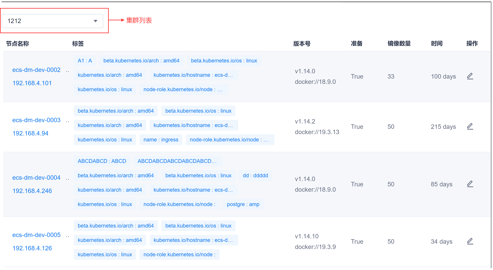
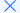
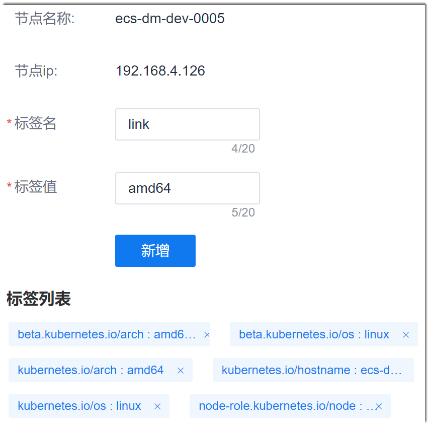

# 管理K8s节点

K8s集群添加成功后，CAP会自动识别集群中配置的节点，并显示在“节点管理”中。您可以查看集群中的节点，并增加、删除节点的标签。

### 前提条件
* 已使用具备项目K8s节点“节点查看”或“编辑节点标签”权限的账号登录系统。

### 背景信息                    
节点标签是附着于对象（例如Pods）的一对key/value的键值组合。然后，可以通过label selector（标签选择器）查询和筛选拥有某些label的资源对象。
label selector的主要使用场景：
* kube-controller进程通过资源对象RC上定义的label selector来筛选要监控的pod的数量，从而实现全自动控制流程。
* kube-proxy进程通过service的label selector来选择对应的pod，自动建立起每个service到对应pod的请求转发路由表。从而实现service的智能负载均衡机制。

标签可以自由添加和修改。每个对象可以有多个标签。

### 管理节点标签
1. 在K8s管理界面的左侧导航栏中，单击“节点管理”。                                       
     右侧页面显示默认集群下的节点列表。                     
     
2. 在节点列表左上角，选择集群。
3. 单击节点最右侧操作列的。
4. 在节点编辑界面中，新增或删除节点标签：
  * 新增节点标签      
       输入“标签名”和“标签值”，单击“新增”。                 
       其中，“标签名”和“标签值”的填写规则请参见冒泡帮助：将鼠标移动到参数后面的图标上。                        
  * 删除节点标签
       在“标签列表”中，单击标签后面的。
        
