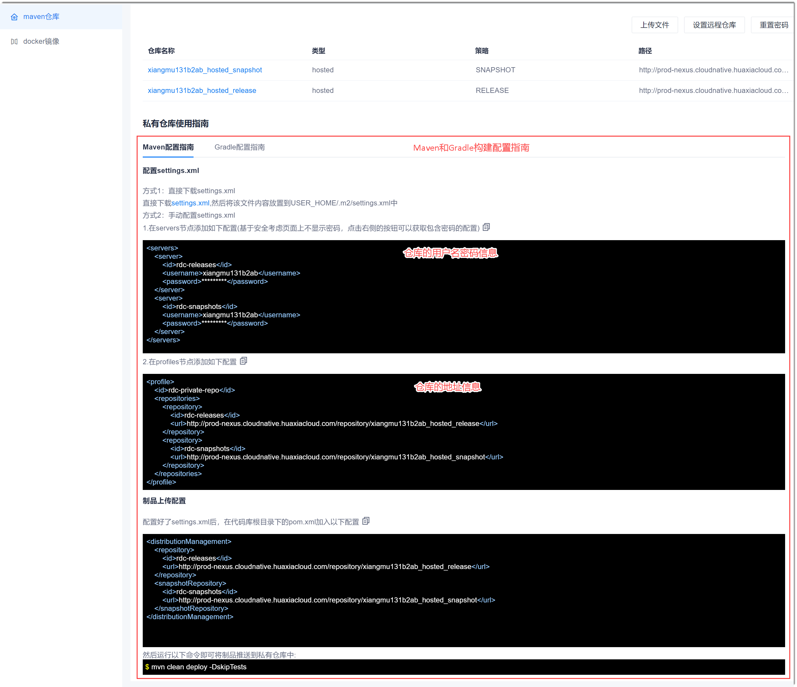
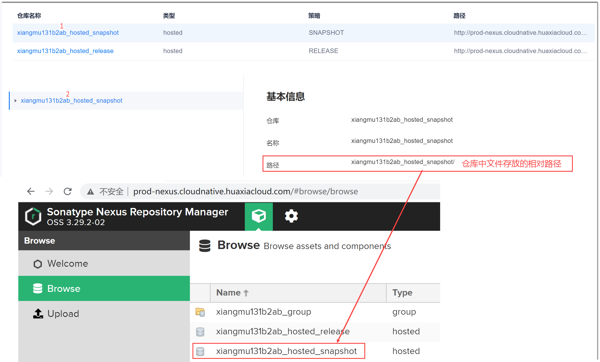
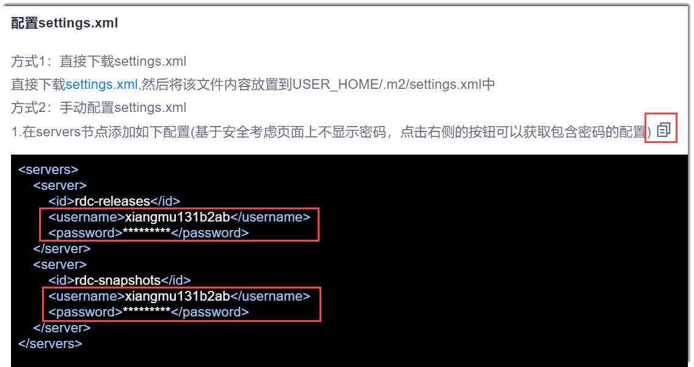
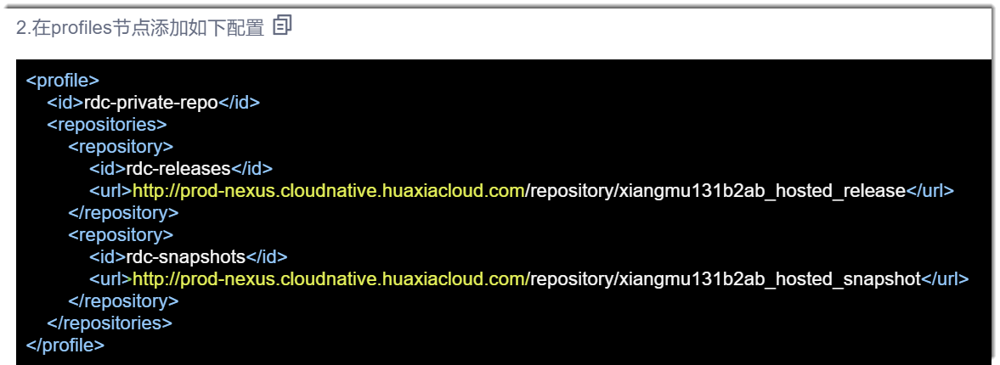
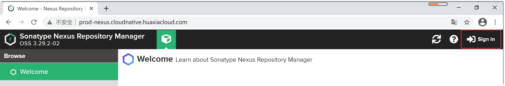
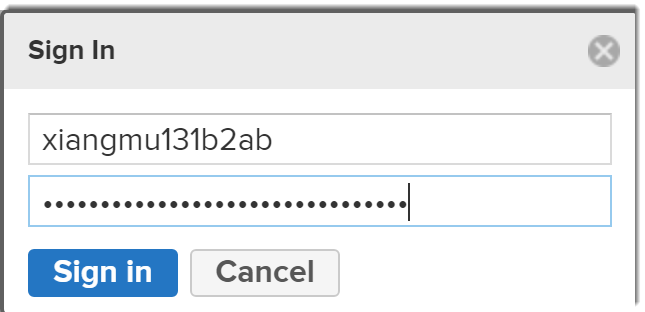
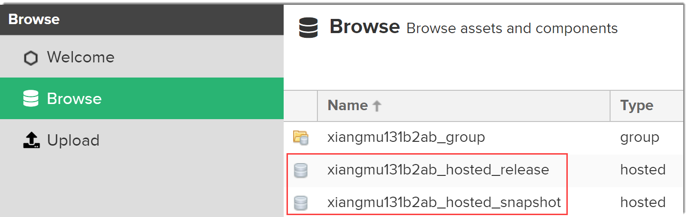

# 查看Maven仓库信息

您可以查看Maven仓库的名称、路径、用户名和密码等信息，通过这些信息您可以访问Maven仓库，或者在流水线中配置Maven、Gradle构建步骤。

### 查看仓库信息
1. 在项目顶部菜单栏中，单击“制品库”。
2. 在左侧导航栏中，单击“Maven仓库”。          
    右侧界面显示Maven仓库的信息。          
                          
3. 单击仓库名称，可以查看仓库中文件的存放路径。           
    
    
### 访问Maven仓库                 
Maven仓库的信息对于Maven构建和Gradle构建都是一样的，因此，下面的步骤同样适用于访问Gradle构建的文件。     
1. 获取Maven仓库的登录用户名和密码。                    
     在Maven仓库信息界面的“Maven配置指南”的方式2第1步中，单击后面的，复制用户名和密码内容。在本地文档中，粘贴复制的内容，获取仓库的登录用户名和密码。                    
                       
2. 获取Maven仓库地址。                    
    在Maven仓库信息界面的“Maven配置指南”的方式2第2步中，拷贝仓库的访问地址，只需拷贝“.com”之前的内容。                        
    
3. 在浏览器地址栏中，粘贴并访问拷贝的仓库地址。     
4. 在弹出的界面右上角，单击“Sign in”。                           
    
5. 在弹出的输入用户名和密码的对话框中，输入上面获取的仓库用户名和密码，单击“Sign in”。                                
    
6. 在左侧导航栏中，单击“Browse”，然后在右侧界面中，单击文件存放的路径，查看仓库中的内容。       

