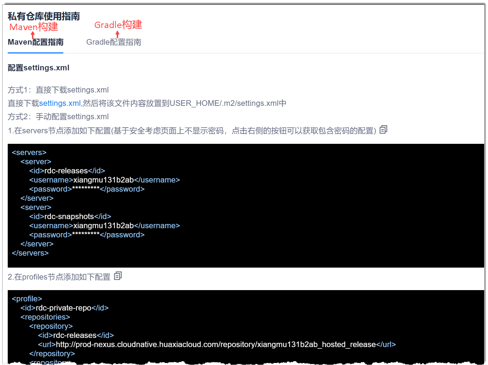

# 查看私有库配置指导

私有库是指非阿里云镜像仓库。因此，当您采用非阿里云镜像仓库时，需要按照操作指导进行配置，才能正常使用Maven和Gradle构建。               
在Maven仓库信息界面中，按照提示的指导进行配置。Maven构建参见“Maven配置指南”中的内容，Gradle构建参见“Gradle配置指南”的内容。          
您也可以参见[Maven构建](12.3.2.1-maven.md)中的“配置setting文件”步骤或[Gradle构建](12.3.2.2-gradle.md)中“初始化配置”步骤的内容，配置私有库。          

