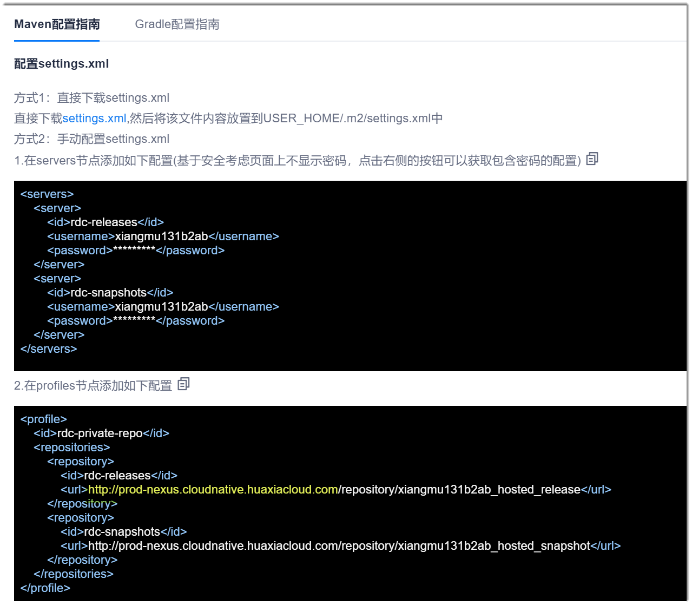
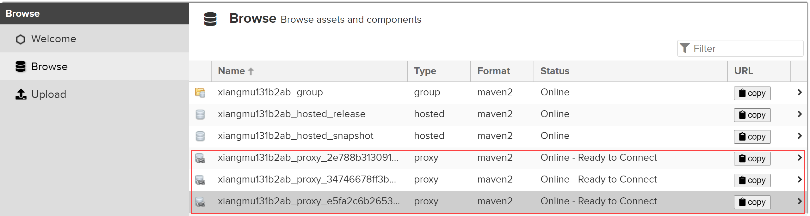

# 设置远程仓库

设置远程仓库后，您可以通过系统的Maven仓库的地址统一查看所有仓库中的内容，即可以通过以下地址查看远程仓库的内容：
          
设置的远程仓库不会在系统的Maven仓库列表中显示，也不能上传文件到远程仓库中，只能查看内容。

### 操作步骤
1. 在Maven仓库界面的右上角，单击“设置远程仓库”。                 
                    
2. 在弹出的“设置远程仓库”对话框中，填写仓库信息，单击“关联仓库”。                   
    
3. 查看远程仓库的内容。
  1. 在浏览器地址栏中，粘贴并访问拷贝的仓库地址。
  2. 在弹出的界面右上角，单击“Sign in”。                          
    
  3. 在弹出的输入用户名和密码的对话框中，输入上面获取的仓库用户名和密码，单击“Sign in”。                               
       
  4. 在左侧导航栏中，单击“Browse”，然后在右侧界面中，单击“Type”为“Proxy”的文件夹，查看远程仓库中的内容。                           
      