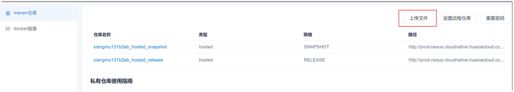

# 上传文件到仓库中

您可以上传相关的文档到Maven仓库中。

### 操作步骤
1. 在Maven仓库界面右上方，单击“上传文件”。                    
              

文件上传后不会显示在系统的Maven仓库中。您可以通过浏览器访问Maven仓库，查看仓库内的文件，请参见[访问Maven仓库](14.2.1-view-maven-repositories.md#访问maven仓库)。