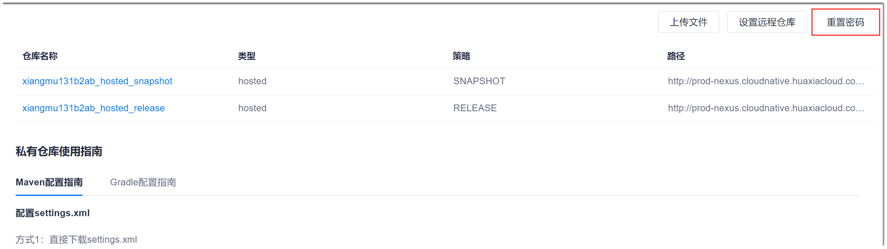

# 重置仓库密码

您可以重置Maven仓库的登录密码。重置后，系统会随机自动生成一个新的密码，之前的密码在30秒内将不能再使用。因此，您在需要时，需重新获取密码。               
重置密码适用于Maven和Gradle构建。

### 操作步骤
1. 在Maven仓库界面右上方，单击“重置密码”。                          
                     
2. 在弹出的确认对话框中，单击“确认重置”。

